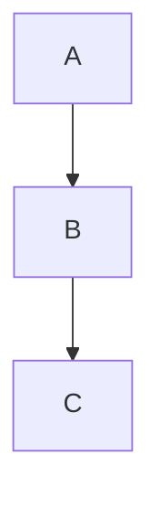

Binary Adages
=============

The source code for my personal blog.

Setup
-----

Requires Python (3.10+ or so):

    git clone --recurse-submodules git@github.com:rayalan/binary-adages.git
    pip install -r requirements.txt
    pelican-themes -i pelican-themes\elegant

Writing
-------

Rebuild on change and host locally (port 8000) with:

    pelican -r -l

And to publish the blog:

    pelican -s publishconf.py
    ghp-import output -b gh-pages
    git push git@github:rayalan/rayalan.github.io.git gh-pages:master

Resources
---------

- There's a blank template under templates, which can be used for a starting post.
- [Elegant documentation](https://github.com/Pelican-Elegant/elegant)
- [Pelican](https://getpelican.com/)

Caveats
-------

### Invoke

As an experiment, there is also support for invoke, e.g.

    invoke build

in lieu of running Pelican directly, but that seems like more work than the pelican commands given above.

### Elegant

Elegant is installed as a submodule, which is unfortunate because parts of it need to be customized.

1. I'm overriding custom.css, especially to provide styling for the SVG elements.

2. I want to edit out the searchbox until I get search working (see below).

These changes make it a bit harder to simply download the latest theme changes.

### Elegant (Search)

Search is not yet working. The outdated documentation is for Tipue search; there's a more modern replacement (based on Stork), but it requires a Linux/macOS setup that I haven't dived into. It may also require theme changes.

### extract_toc (plugin)

[extract_toc](https://github.com/getpelican/pelican-plugins/blob/master/extract_toc/extract_toc.py) is a Pelican plugin that hasn't yet been exported to a standalone Python package. For now, it is simply copy-and-pasted into a folder, but in the future, it should be installed via requirements.txt when it is a standard Pelican plugin.

### Color Scheme

The basic Elegant color scheme is something like:

* #maroon - Titles
* #dimgray - Categories
* #3875d7 - Anchors
* Dark gray or black - Text
* Offwhite - Background

For charts and graphs, the following color schemes are suggested:

* #008080 (Complimentary)
* #008000, #000080, (Tridic)
* #408000, #008080, #400080 (Tretradic)

### SVG Images

Since SVG images don't allow CSS styling, use <object type="image/svg+xml" data="images/name-of-image.svg" class="svg"> to include SVG images inline. pelican-themes/elegant/static/css/custom.css contains the custom for SVG images.

### Mermaid Diagrams

Mermaid diagrams can be included like this:

Currently, color styling hasn't been applied to Mermaid images.
