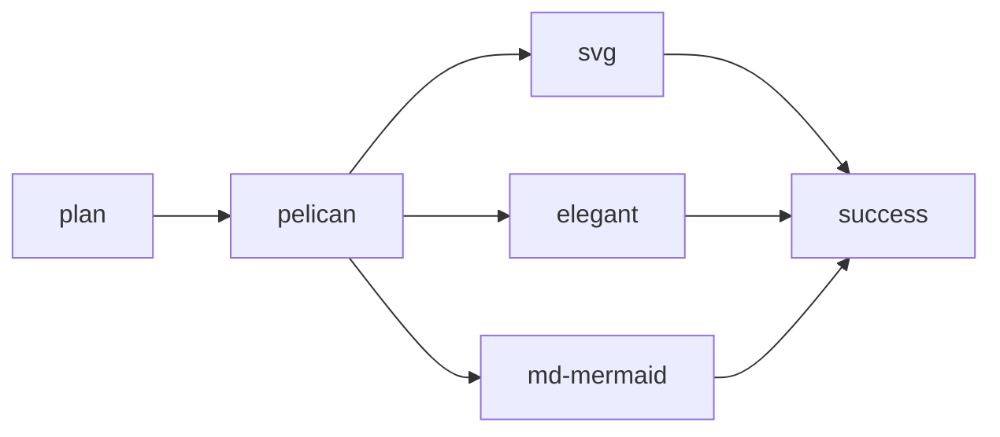

title: Blog Revamp
date: 2022-06-01
category: projects
tags: ablog, python, js, mermaid, markdown, restructured-text, svg, charts
subtitle: How hard can it be?
status: published

[TOC]

It's been about five years since my last attempt at a blog, in which I think I wrote a post[^old-blog]. With a bit of spare time on my hands, I want to revamp my setup...

# Revamp Goals

In no particular order, my goal was to:

1. Revisit the technology selection (especially [ablog](https://ablog.readthedocs.io/)).
2. Use a DevOps-oriented approach (e.g. text, source control)
3. Trivially include [mermaid.js](https://mermaid-js.github.io/mermaid/#/) diagrams.
4. Trivially include simple charts.
5. Hone and improve my skills.
6. Spend less than a week creating the platform.
7. Make the blog look decent initially.
8. Be prepared to iterate in the future.

# Rationale

Why these goals?

Overall, I write to talk about the art of software development. My primary medium is words, sentences, articles. I lean heavily toward longer, more thoughtful pieces. So a blog, not a Twitter or YouTube account.

Yet maintaining interest with a long wall of words is hard. Furthermore, the complexities of software development often benefit from pictures to demonstrate key concepts. I've really enjoyed working with Mermaid.js over the last couple years, and it can trivially do about 80% of what I envision wanting for visualizations. However, Mermaid can't (yet) do simple illustrations such as Jessica Hagy does with [Indexed](https://thisisindexed.com/). So I need to be able to do a bit more than just what Mermaid supports.

As a long-time developer, text is easy to edit, merge, and otherwise manage in source control. Something like Markdown makes it easy to reskin the whole blog later without touching any of the content. Tools like Mermaid.js are useful precisely because they allow  text to be easily rendered as a visualization, giving the best of both worlds.

For the project, I want to find the right balance between getting it setup enough that I don't have to quickly revisit my choices, but not have to worry about getting every _i_ dotted before working on writing. I know that I tend to ignore aesthetics, but a hideous blog will quickly turn others away, so it needs some early attention.

Finally, I wanted to revisit the technology selection because for a few reasons:

* For as rarely as I write, I find ablog and [Sphinx](https://www.sphinx-doc.org/en/master/) to be a bit too complicated for my tastes.
* I last picked the technology stack for my blog five years agoFive years have passed since I picked a, and now I know more and the tech landscape has changed.
* ablog is no longer with its original developer and almost entirely in maintenance mode. I've hit a few sharp edges when trying to integrate it with other Sphinx plugins, and I don't really want to keep dealing with that.

# Execution

So how did the plan go?

## Markdown and Pelican

A bit of Googling turned up [Pelican](https://getpelican.com/) as a simple way to generate static sites from text. It support multiple themes, seemed more straight forward, and already supported a Mermaid extension. From prior experience, I knew that GitHub was an easy way to host a static site, and there was already existing Python/Pelican support for exactly that via [ghp-import](https://github.com/c-w/ghp-import).

I'd also wanted to consider MarkDown as it has become the lingua franca for so much documentation[^markdoc]. Diving into MarkDown extensions revealed that a number of improvements had been made that brought it close to par to reStructuredText, at least for my needs -- table of contents and footnotes. In particular, table of contents, footnotes, definition lists, metadata,

[^markdoc]: Stripe recently released [Markdoc](https://markdoc.dev/), which is a bit beyond my personal efforts right now, but very much has my attention as a documentation system.

Spinning up a basic Python+Pelican blog went crazy fast. Pelican had good documentation, a quickstart feature along with development support for local hosting, caching, and automatic rebuilding on change. Once setup, I had a really fast writing loop. The biggest glitch was some experimentation around properly loading and configuring the Markdown extensions, which was poorly documented.

## Elegant

Pelican claims a list of [127 themes](http://www.pelicanthemes.com/). Good design on Pelican's part made it trivial to swap out themes, and I quickly found a very thoughtful theme called [Elegant](https://github.com/Pelican-Elegant/elegant) which was carefully thought out. Their documentation entries on design philosophy reflect a deep interest in user experience, and brought in lots of cool features such as subtitles, series, tags, and automatic interlinking. It also supported Pelican plugins such as comments (e.g. Disqus), analytics (Google) along with a reasonable static page display.

However, a few problems started cropping up:

* Pelican is changing over its plugin system, and now that I had a table of contents supporting theme, it was clear extracting the table of contents through Pelican required a bit of elbow grease.
* Elegant's search expects to use a plugin called Tipue Search, which is deprecated. Worse yet, Elegant hasn't been updated to use the replacement (which doesn't appear to be Windows friendly), and lacks a configurable option to disable search.
* Pelican/Elegant don't support overriding the theme in a way that supports keeping Elegant's code unmodified for easy updates.
* The [Elegant demonstration page](https://elegant.oncrashreboot.com/) (which I used to decide Elegant was a good theme) has gone dark. It might be a temporary glitch, but given the lack of Elegant development for a couple years and Elegant being a theme for a static site, it suggests that its maintainers really have moved on.

### Adjustments

I ended up making a few changes:

1. I decided I wouldn't support search functionality for now. It's a fantastic feature, but getting [Stork](https://github.com/pelican-plugins/search) (the Tipue Search replacement) running on a Windows box where I don't even have WSL configured isn't worth the time. In the near-term, tags and categories should provide plenty of visibility into my small blog, and I can iterate on search in the future. In the very near term, I can even live with a broken search box.
2. I took the old Pelican plugin for table of contents and placed a copy (it is about 70 lines) in my blog. In the future, I can look into making the native Markdown table of contents extension play with Pelican/Elegant's expectations, or perhaps the plugin will be made a standard Pelican plugin. For now, the local file is a small nuisance.
3. I forked the Elegant theme and made it a submodule rather than installing it via [pelican-themes](https://docs.getpelican.com/en/stable/pelican-themes.html). The downside is that applying Elegant updates will be significantly harder than I would prefer -- although there don't seem to be many these days. On the plus side, I can make personal modifications such as removing the search box, making search box optional, or customizing the CSS.

For now, the possibility that Elegant is end-of-life doesn't concern me. It looks better than I can quickly do on my own, gives me a jumping off point for the feature, and is disconnected enough from Pelican or my content that I can iterate in the future.

## Mermaid

In theory, [Mermaid support](https://pypi.org/project/md-mermaid/) should have been about one line:

    pip install md-mermaid

But that didn't work because of some error about md_globals. Diving into that revealed that the Markdown interface had progressed but that the md-mermaid extension hadn't been updated - despite someone posting the patch about a month ago.

Additionally, I realized that the plugin assumed that the Mermaid JS files were already included in the HTML. Because I prototyped the Mermaid integration before selecting Elegant, I was hoping to avoid messing with the CSS templates.

### Adjustments

As a result, I forked md-mermaid to support:

* The most modern Markdown interface
* Configuration options for which Mermaid url and version
* Configuration options for automatically including the Mermaid JS files.

As an added bonus, these changes will make it far easier to passing styling options to Mermaid if I want a more consistent look. Hopefully the md-mermaid plugin isn't dead, and my changes can be re-integrated.

### Demonstration

What's the end result? Well, here's a quick flowchart of my plan:

It may get a bit sharper as I work on styling in the future, but it's a lot better than a wall of text.

## Other charts (SVG)

Finally, I wanted to be able to do a bit more with simple charts and diagrams than Mermaid supports. Diving into it, there is a long list of options, from D3 to free plugins to commercial plugins.

I ended up settling on SVG for a few reasons:

* Dirt simple for basic functionality
* Text-based, keeping with the philosophy of configuration-as-code, source control, and the like.
* Capable of far more advanced capabilities if I needed it in the future.
* Supports CSS styling
* Many tools support exporting to SVG, letting me pick from a wide-array of tools in the future to make my diagrams.
* Markdown already supported including SVGs via including images

### Adjustments

My first attempt at SVGs failed miserably:

    

It turns out that SVGs that are included as images can't be styled by CSS. I'm sure there's a great reason why SVGs have three slightly incompatible ways of using them, but it's a prime example of why software is difficult: I want to include an image in my Markdown and have it JustWork, and it won't because of weird technical nuance.

After digging through Stack Overflow, tutorials, and some experimentation, I figured out how to use an HTML object directly in Markdown text to specify an object:

    <object type="image/svg+xml" data="images/simple-svg-sample.svg" class="svg">Simple SVG Image (unstyled)<!-- fallback image in CSS --></object>

It isn't as clean as the original syntax, but it works. I also figured out how to specify the viewbox so that the right column of the Elegant theme overlap with the images.

### Demonstration

Here's my first simple SVG image:

<object type="image/svg+xml" data="images/simple-svg-sample.svg" class="svg">Simple SVG Image (unstyled)<!-- fallback image in CSS --></object>

And here's one with some labels and a bit more styling:

<object type="image/svg+xml" data="images/inline-svg-sample.svg" class="svg">Styled inline SVG Image<!-- fallback image in CSS --></object>

It isn't perfect by a long shot, but the basic capability is there. In the future, maybe I'll look for a way to teach Markdown to include SVG images inline.

# Retrospective

Looking back, how did the project go?

Overall, I'm very happy.

* The tech stack is revamped with a nicer theme; I can easily use diagrams, and I have understood several future problems if I ever want to tackle them.
* I ended up with a text-based solution that supports experimentation, quick rollouts, and reversions.
* The week I spent was inline with my expectations, and included defining several future possible iterations.

Lessons learned:

* Tying technologies together is always trickier than it first appears.
* Windows (the operating system) is definitely a second class citizen when it comes to many technologies (such as Stork). It's hard to get a clean, simple, and full-featured technology stack for Windows.
* I wonder if a JS-based solution (e.g. Markdoc) would have yielded a cleaner solution.

[^old-blog]: In fact, I didn't even get all the blog committed to source control (oops!) so I ended up pulling the content from the published blog. However, my old system did provide the original reStructuredText for published pages, so getting the content was trivial. A good reminder of both how well configuration as code works as well as the importance of good processes.
