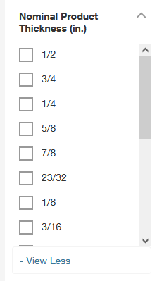

title: Home Depot Search
date: 2022-06-20
category: crossover reviews
tags: user experience, left-field reviews
status: published

[TOC]

Periodically, I like to look at the user experience as an individual consumer, not as a professional, and then link those observations back to professional software development.

Occasionally, I pretend I have some woodworking skill and build something. Since [Home Depot](http://www.homedepot.com) is my nearby big box store of choice, I'm often looking at their website. On the surface, I'd expect their website to be impeccable -- both as a lure to bring me into the store and as a way to compete against Amazon and the like. However, I constantly struggle when I go to use it. After I cover a couple of recent examples, I'll close out with a few thoughts about software development.

### Plywood

I want some plywood, so I search the website for "plywood." This search brings me to a nice page listing some of the specifics I might want -- hardwood plywood, MDF, project panels, 1/2" nominal product thickness, and so on.

And on the left, there's this thickness selector:

.

Most of that is pretty normal -- except for the 23/32" entry. I'm pretty sure that nominal product thickness means the common thickness given, not the actual thickness. And Home Depot thinks so too, because their top level selector offers two nominal thickness values - 1/2" and 3/4". See this image:

Here are some of the offerings in that category:

Notice anything strange? That's right, 2 of the offerings are listed as 3/4". So while the 3/4" category contains 58 entries, the 23/32" category contains 12 -- including the economical sanded plywood entries that I suspect are what many people are looking for when they want of 3/4" plywood -- and yes, this means the top-level selector pictured above likely won't show a key product.

This leads to some interesting questions:

1. Did Home Depot intentionally split their 3/4" and 23/32" plywood into two categories?
2. If yes, does Home Depot believe that the average shopper looking for "nominally" 3/4" plywood really cares about 1/32"?
3. If no, is there a data quality issue such that about 15% of the products have bad data?

### Cutting Service

Here's another fun example: Home Depot offers a very cool service for DIY projects where they will cut boards at the store for you -- often for free or with a nominal charge. Fantastic for when one's vehicle won't fit a full sheet of plywood or an 8' 2x4.

When I search for ["Home Depot cutting service"](https://www.google.com/search?q=home+depot+cutting+service) or "Home Depot cut wood for you" or similar terms, I get plenty of third-party sites telling me all about this wonderful service. But no results for Home Depot. Nor does entering the term "cutting" into the Home Depot search area. Their lumber and composites section has this blurb to encourage visiting them:

But no mention of their cutting service.

# Retrospective

If the plywood categorization was a freak mishap, I'd almost certainly brush it off. But instead, I regularly find products miscategorized when I want something from Home Depot. As a result, the selectors are time consuming as I try to figure out all the options that I might need to check. Emotionally, I find myself irritated and distrustful -- not the outcome I suspect Home Depot wants to inspire.

I'm sure none of this difficulty is intentional. I'm also sure product data is incredibly hard for Home Depot[^others], which is managing many thousands[^thousands] of products. But the net result is that I still wish for alternatives every time I laboriously hunt through Home Depot's website. And that what could be a competitive advantage -- a crazily useful product locator -- instead becomes a liability.

For me, this is an illustration of how it isn't just about the right feature set or the right data; it's about the system working well for end users. It's easy to deliver a feature set, but miss the actual consumer needs.

## Last Thought

One final musing: I wonder if this failing is because of the technical difficulty, the lack of business value, or something else. Technically, I'd expect this is a fixed cost solution -- the right designs, the right data entry protections, maybe a way for users to easily flag problems -- and the problem would basically stay solved. The biggest variable cost I would expect to be data entry, which already seems to be something Home Depot is doing. Since Home Depot hasn't done that, the problem might be more complicated than that -- especially if their backend data systems are a mess, or their computing systems aren't well integrated with, say, their suppliers.

Another possibility is that there just isn't enough business value in fixing the problem. Maybe making products easy to locate just doesn't pay off. That's hard for me to imagine, but maybe they mostly win on factors such as location, convenience, and dealing in goods that are less prone to online competition (such as by being bulky).

[^others]: And others. Home Depot certainly isn't alone in this struggle.

[^thousands]: Or millions? I suppose "Estimate how many products are in Home Depot's database?" could be a fun interview alternative to "How many windows are in Seattle?"
