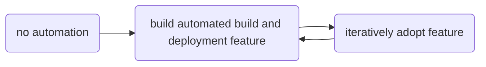

title: Paralyzing Success
date: 2022-07-04
category: mistake monday
tags: cicd, devops, agile
status: published

[TOC]

Retrospectives are one of the practices I most value from the Agile ceremonies: Taking the time to look back, think over what happened, and learn from one's decisions, good and bad. In today's Mistake Monday article, I look back at a fundamental design flaw I made in many of my early continuous integration / continuous development automations.

Here was my basic concept for how to roll out automation:

Early on, there was almost no automated build or CI/CD support. Gradually I built up the capabilities and sold others on using the new capabilities. And for some time, this process went swimmingly. And then it ground to a halt.

_What had I done wrong?_

Well, I had centralized the system. Basically, a change either went live to everyone, or to no one. And when the system did offer a choice of whether to adopt a feature, it was an all-or-nothing choice: Adopt all the feature improvements available, or adopt none of them.

As long as the number of users of the system was small, this centralization wasn't a big deal. But the more teams that used the system, the more divergent their practices. Some didn't want a feature. Or they wanted the feature, but not in the middle of crunch time. In some cases, they wanted to adopt the feature in one or two of their projects, but not all. Sometimes the changes required mandatory Python upgrades -- which might not be backward compatible with all of that team's build dependencies.

Eventually with enough teams, it was never a good time to upgrade. There was always an incompatibility. Someone always didn't want to learn the new behavior. And so the system improvements stopped -- the CI/CD capabilities became effectively frozen.

# Lessons Learned

1. Massive one-shot rollouts are really hard. While they may be sometimes necessary, it is often far preferable to do gradual controlled rollouts.
2. Successful development isn't just about having the solution, but in getting it adopted.
3. Self-contained project-specific build configuration has a lot of upside: Each project can change at its own pace, independent of any other system[^downside].
4. Adoption and transition plans are first-class problems who need to be solved in designing the software. It isn't enough to build the solution, and then ask: How are we going to roll this out? Yes, this approach makes software more expensive -- but it's a true part of the cost.

# A Happy Example

As a way of counter example in another of my projects (done later), behavior changes were made individually to hundreds of thousands of users. Each change included an explanatory e-mail, and the team managed how many of these changes went live each day. This allowed careful testing of the changes -- including the notifications -- before any users saw different behavior. Then the transition process was tested on small numbers of users. When those tests went well, the remaining users could be converted whenever. Because the same transition process was used from testing to the final conversions, there weren't any late surprises.

# Final Thought

In many cases, transitions and upgrades cannot be just an afterthought; they need to be part of the primary design.

[^downside]: Yes, having to update each project configuration to make a change is cost -- sometimes a high one -- to pay for this.
