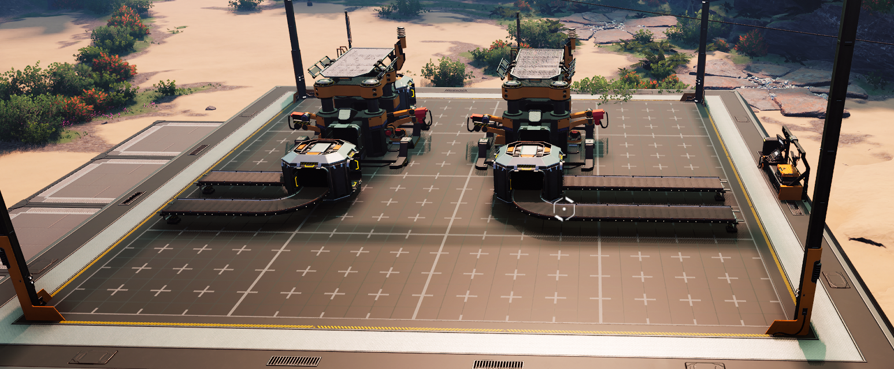
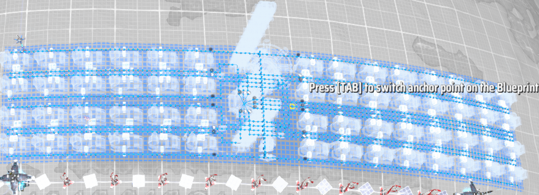
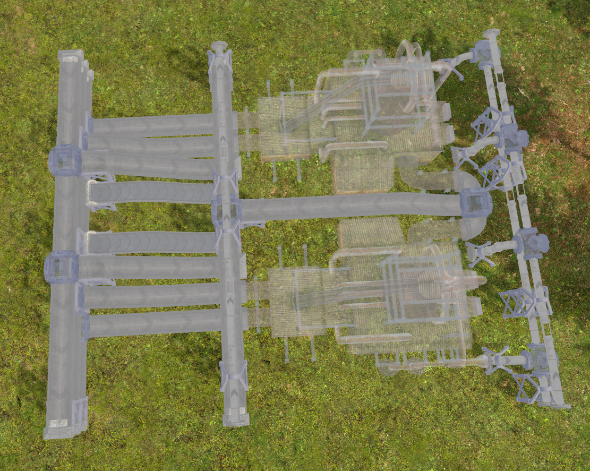

title: One idea, many interpretations
subtitle: A case study
date: 2023-11-14
category: user experience
tags: knowledge, uncertainty, case study
status: published

_How many ways are there to implement a feature?_

Sometimes I think about a feature like "tagging" or "billing for software as service" or "webhooks" and think: How many ways could there really be to implement these features? Yes, there are different technical architectures with corresponding non-functional tradeoffs. But assuming all those approaches are correctly implemented, how much difference can it make to the customer?

I thought it'd be fun to answer this by looking a feature (blueprints) implemented, roughly at the same time, by three very similar games: [Captain of Industry](https://www.captain-of-industry.com/), [Dyson Sphere Project](https://store.steampowered.com/app/1366540/Dyson_Sphere_Program/), and [Satisfactory](https://www.satisfactorygame.com/).

All three focus on building and automation.

All thee implement blueprints as a way to speed up building and reduce the tedium of large-scale tedium.

All three are very positively reviewed by users.

All three share a core concept for blueprints: Blueprints can be created, saved to disk, sorted into categories (folders), and used to rapidly build structures in the game.

So how much variation can there be in the implementations? Well, let's take a look...

# Satisfactory

Satisfactory starts about being unique in a couple ways. It is a first person view, played from the perspective of a person, rather than presenting an overhead view. As such, it fully embraces building upward, layering factory floor on top of factory floor.

In their implementation, blueprints are:

* Restricted to a 4x4 unit square (length and width), but up to 8 units high.
* do not automatically connect belts, pipes, or power when built; those must be manually connected.
* Only created or modified in a special building.

For context, a 16 unit squares means something like 1-8 machines per level, but the 8 unit height allows for blueprints to have 2-4 levels. Combined with the lack of automatic connectivity for pipes, belts, and power, this approach encourages two types of blueprints:

1. Highly compact builds. Some players have made builds filled with far more machines than expected.
2. Decorative builds -- a section of straight roadway that can be repeated over and over or a particular aesthetic for doors and corridors.

The dedicated building for creating or modifying blueprints makes it really easy to edit blueprints, but the limits on size and manual connections make it really hard to use blueprints to build at scale.

# Dyson Sphere Program

Dyson Sphere Program, in contrast, focuses on large-scale blueprints. As a game whose scope grows from a single planet to a galactic scale, there's corresponding research to unlock larger blueprints, eventually leading to planetary-scale blueprints.

The blueprint implementation is a simple one:
* Select some buildings to save them as a blueprint.
* Select the blueprint to build the exact same buildings somewhere else.

Notably, it's not easy to modify existing blueprints. Blueprints are specified by filename, with existing filenames not visible when saving blueprints. And until very recently, metadata such as the blueprint names or images had to be re-entered each time the blueprint was saved.

The implementation here is designed to support plopping large-scale blueprints onto planets. And it works fantastically for that. But when it comes to modifying or tweaking blueprints, this approach struggles.

# Captain of Industry

Captain of Industry takes an entirely different approach. In addition to a blueprint feature, it has a full-fledged planning layer, where buildings and layouts can be planned, modified, and tweaked before actually being built. This planning layer makes it easy to modify blueprints before implementing them -- or to modify them and then save them again.

The planning layer also supports cut-n-paste, so it's easy to design a layout when one isn't sure about the final size, and then relocate that layout into the available space once everything is planned out.

Because terrain matters for more in Captain of Industry than other games, there are some effective limitations on how big a useful blueprint can be. But there's no forced limitations such as in Satisfactory.

Of the three, Captain of Industry's implementation is the best, but primarily because of another feature: The planning layer.

# So what

Three lessons stand out to me:

1. When I can't think of an alternate implementation, it probably means I'm tunneled vision on a particular implementation.
2. Features don't stand alone; they interact with the other features. Satisfactory's limited blueprint sizes or manual connections would be intolerable in Dyson Sphere Program, for example.
3. Some features are just good ideas. All three games, for example, would heavily benefit from a planning layer. But the cost might be too high for the benefit given the different contexts.

What other lessons should I have learned?
