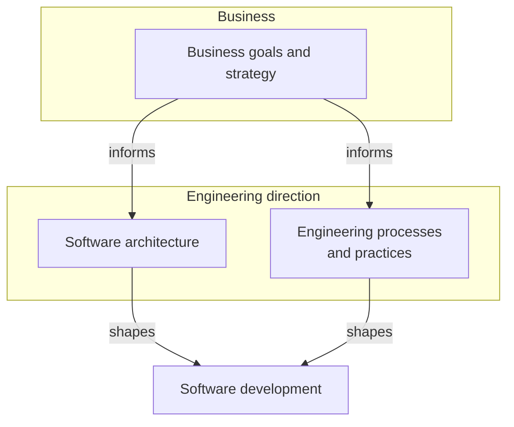

title: About

Hi!

I'm Alan, and I muse about software engineering, especially the systems and processes that deliver anticipated software in a timely and economical manner. Or at least, that's the goal. Most of us know what happens when those processes aren't working -- software starts shipping late, or with bugs, or at great expense -- or all of the above. In the nightmare scenario, it doesn't ship at all[^nightmare].

In other words, this is the world I live in:

Here's a few resources that have significantly shaped how I approach software[^material]:

- [The DevOps Handbook](https://www.amazon.com/DevOps-Handbook-World-Class-Reliability-Organizations/dp/1942788002) (or see [this excellent summary](https://medium.com/@stefanthorpe/the-devops-handbook-series-part-1-establishing-the-three-ways-c36e8f98fb56)).
- [Chose boring technology](https://mcfunley.com/choose-boring-technology).
- [Team Topologies](https://teamtopologies.com/) and [Conway's Law](https://en.wikipedia.org/wiki/Conway%27s_law).
- [Joel Spolsky](https://www.joelonsoftware.com/2005/05/11/making-wrong-code-look-wrong/).
- Martin Fowler, especially [Maximizing Developer Effectiveness](https://martinfowler.com/articles/developer-effectiveness.html).

Still interested in what I have to say? Start [here](/archives.html).

Know a job that might be a good fit[^curious]? See my more in-depth [profile]({filename}/pages/profile.md) or reach out via [LinkedIn](https://www.linkedin.com/in/alan-ray-3513aa14/).

[^nightmare]: To be fair, there are projects where not shipping actually would have done less damage to the company's credibility than the bug-ridden mess that marketing acclaimed as a "a once in a time masterpiece."

[^material]: Or some cases, these resources are a clear and concentrated presentation of ideas that I've built up over decades in the industry.

[^curious]: Or perhaps you're curious how I market myself. Take a look and reach out to let me know how I'm doing on [LinkedIn](https://www.linkedin.com/in/alan-ray-3513aa14/). A regular dose of feedback is a good habit to maintain. Hopefully I'll give you a few ideas on how to present yourself too.
