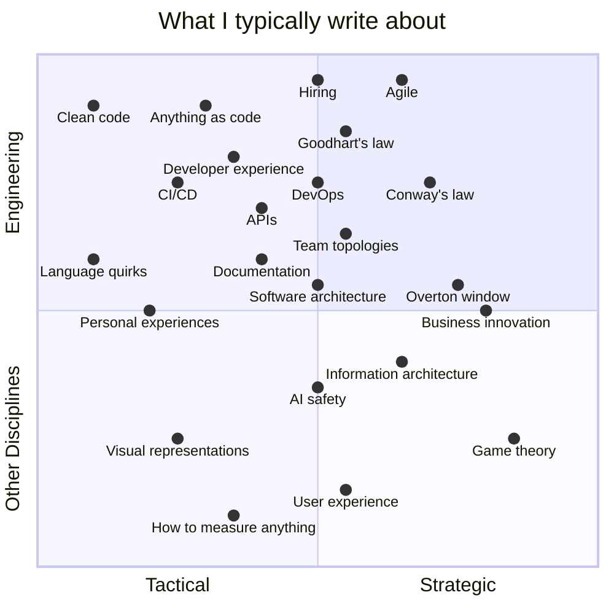

title: Obligatory Introduction
status: hidden
slug: landing-page-about-hidden
layout: page

Hello! Welcome to my musings about software engineering and more, such as...

```mermaid
quadrantChart

title What I typically write about
x-axis Tactical --> Strategic
y-axis Other Disciplines --> Engineering

CI/CD: [0.25, 0.75]
APIs: [0.40, 0.7]
Developer experience: [0.35, 0.8]
Clean code: [0.1, 0.9]
Language quirks: [0.1, 0.6]
Documentation: [0.4, 0.6]
Anything as code: [0.3, 0.9]

Hiring: [0.5, 0.95]
Agile: [0.65, 0.95]
Goodhart's law: [0.55, 0.85]
Team topologies: [0.55, 0.65]
Conway's law: [0.7, 0.75]
Overton window: [0.75, 0.55]
DevOps: [0.5, 0.75]
Software architecture: [0.5, 0.55]
Business innovation: [0.8, 0.5]

Game theory: [0.85, 0.25]
User experience: [0.55, 0.15]
AI safety: [0.5, 0.35]
Information architecture: [0.65,0.40]

Personal experiences: [0.2, 0.5]
How to measure anything: [0.35, 0.1]
Visual representations: [0.25, 0.25]
```
