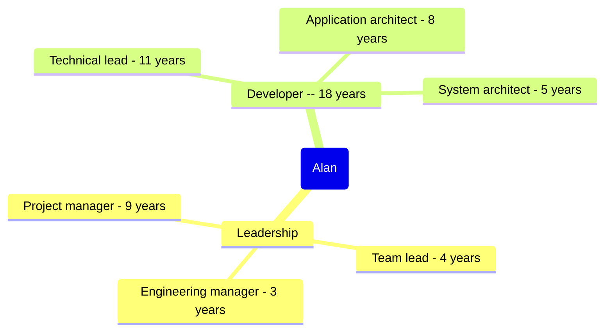

title: Experience Showcase
subtitle: Alan Ray Profile
status: hidden
slug: profile-experience-showcase
layout: page

[TOC]

One of the best parts of small, fast-moving companies is the chance to do what what is required, regardless of one's official title[^title]. Over the years, I've worn many hats, sometimes formally and often informally:

[^title]: One of the downsides of working for small startup companies is the necessity of doing what is required, regardless of one's official title. Another downside is that roles and titles don't keep up with reality.

This pages showcases the value I bring in three roles:

* [Architect](#architect-showcase) - guiding and setting technical requirements in the context of business requirements
* [Solver](#solver-showcase) - diving into complex problems and finding a path forward.
* [Team Growth](#team-growth-showcase) - Enabling individuals and teams to be better engineers

# Spotlight: Billing System Overhaul

__The problem__: My company was using a custom in-house billing that had grown up around the existing business model and was deeply intertwined with current business practices. While the system was good at what it did, it was brittle:

* Testing changes prior to production was effectively impossible -- and changes hit all customers simultaneously.
* Common software-as-a-service operations such as custom pricing or discounts were difficult at best.
* Reports didn't live up to executive or accounting expectations.
* Rather than being modular, the custom software was hard-coded into at least five different systems, some of which were legacy systems.

The goal was to modernize the billing system by replacing the current in-house system with a third-party system. The project goals were something like:

* Modernize the system, bringing it up to best practices. It should be testable and maintainable; it should be trivially extensible to common billing models; it should readily provide executives, accounting, and other stakeholders with answers to their questions.
* Minimize the transition time when both systems were in place. Because the company had a large number of employees who interacted with the system, minimizing the period of time when employees were having to keep two different mental models in mind.
* Minimize the number of changes to billing. Again, because many employees interacted with the system, there was a strong desire for the new system to behave like the old way.
* Maintain business continuity -- customers should not be disrupted; billing needed to continue without interruption.

And that's where the project started -- an ambition, but no project plan, no technical details, no team.

## Outcomes

After selecting a third party-system (see more [here](./profile-professional-strengths#example-project-definition), my role was architect, team lead, project manager, and part-time developer. That meant everything my work included:

* Assembling the team to communicating with stakeholders
* Figuring out how to satisfy business requirements
* Architecting not just the new systems, but the transition and test plans.
* Ensuring
* Training the team on new approaches such as microservices and gradual, controlled data transitions.
* Solving thorny problems such as idempotent webhook handling and ensuring transaction visibility to customer service.

Over the course of about a year, my team shipped a series of continuous delivery releases where the new billing system ramped up from small in-house tests to a small number of new customers to all new customers to a small number of migrated customers. Finally, a rapid migration of all customers happened in a period of about 45 days. This approach meant that over the course of a single billing cycle, the system transitioned 98% of subscriptions from the old system to the new one, successfully meeting the company's goal to minimize cognitive load for employees.

The new system was not only supported a robust staging environment, but also supported per-customer migration, allowing the company to roll out a price change or a new billing model and then chose how gradually or rapidly to transition. The third party-solution enabled the ability to generate quality reports as well as quickly extend the system for other models.

I built strong relationships with stakeholders, especially accounting and customer service. For example, I built real-time channels for communicating with customer service and deliberately trained them. As a result:

* The new system was far more efficient, requiring fewer hand-offs to accomplish common billing operations. First call resolution for billing-related calls rose from under 1% to over 95%.
* Customer service representatives had near real-time answers for complex scenarios, and bug fixes or wording improvements were often delivered within 2 days.
* Dozens of customer service representatives seamlessly switched from the old to new billing system in under a month.

At their annual award ceremony, customer service would go on to create their first (and to my knowledge, the only every) inter-department award for my team for having partnered well with them in transitioning between systems. The ongoing relationships would go on to help define future work, even after the initial project was complete, resulting in more responsive development.

Technically, the project solidified a number of new capabilities at the company, including highly-modular microservices, telemetry, idempotent wehhook procosses pushing errors to developers, and controlled migrations. The work would proved to easily extensible: In the future, several key projects (such as [this one](./profile-professional-strengths#driven)) would take weeks rather than the months they would have taken in the old system. Common operations such as price adjustments moved from being a major all-hands-on-deck events to being 1-2 day operations that a single developer could do through normal build/test/release processes.

_What was one lesson you learned from this project?_ At the start of the project, I was handed a clear vision for the long-term non-functional behavior. My assumption was that these outcomes were firmly established in the company culture. The executives had set them, the company had invested in significant resources in overhauling the old system, and these requirements were critical to many future business plans. I didn't anticipate once the overhaul succeeded, everyone would forget about the long-term requirements. While I had documented the non-functional requirements, I hadn't done much work to deeply embed them into the company culture. The result was that by the time I realized that there was a problem, the long-term vision had largely been lost.

From that, I learned that truly transformational change needs to be far more deeply embedded than one successful project. People will move on, reorganizations will happen, crisis will occur. And the guiding principles of a critical system can't just be written down; they need to be understood by developers, by designers, by project planners, by senior leadership. And I learned that I needed to start effecting that kind of awareness from the start of the project.

# Architect Showcase

Beyond the [billing overhaul](#spotlight-billing-system-overhaul), here are examples of my architecture work across systems with a major business impact.

## Live Algorithm Parameter Adjustment

__The problem__: A team ("ProductUser") at my company was responsible for monitoring and adjusting the behavior of a number of algorithms responsible for high-volume real-time text analysis. The modification tools were outdated, leading to a number of problems:

* A number of different tools were required, requiring complex and error-prone workflows as employees switched between tools.
* The tools frequently crashed, forcing employees to restart tasks.
* Employees could only validate changes by deploying modifications in production environments. Even then, differences due to regional differences could not be detected.

The project was to create a reliable streamlined workflow for the team.

### Outcomes

With my work as architect (and lead developer), the result was a robust webapp that supported a commit-style approach to making changes. The ProductUser team found their workflow dramatically more efficient; while the number of incoming requests would double in the coming years, the team size slightly shrank due to the improved efficiency. On the handful of occasions where an error made it into the production system, it was quickly identified and reverted thanks to excellent visibility into past changes. And because of its robustness, the application itself didn't even require a maintenance team (as demonstrated by the fact that it would go years without a maintenance team or significant incident).

One of the big technical decisions contributing to these business results was that the web tool allowed algorithm changes to be proposed, tested, and, if successful, deployed to production. While previous workflows had required multiple tools, a change was a fully self-contained set of actions, not only changing algorithms but also coordinating customer communications and various auxillary tasks. This approach meant that the history of algorithm changes was easily reviewed, which meant that if problems arose, recent changes could be rapidly reviewed.

This new web application would go on to be the only tool for controlling the algorithm for a number of years; good design and anticipation of possible error scenarios led to a robust design such that after it was completed, it never had an official team to maintain it[^reorg]. Instead, about once a year, someone from that initial team would hit the proverbial "reset" switch. The tool would go on quietly doing essential work for years without any additional development.

[^reorg]: During original development, the intent was for the application to have ongoing maintenance and eventually grow into a big system. However, shifting priorities and reorganizations eventually led to the application remaining a critical part of the business but without a clear owner.

Technically, my contributions to the success of this work included:

1. Innovated after carefully understanding the problem. I realized that source control had already solved a similar problem, and convinced my team that a simple system to manage changes was not too hard for non-technical users to understand. Initially I explored the possibility of simply recording changes in Git. When that proved technically infeasible because of particulars to the project, I paired with a database expert to develop a specialized SQL to provide the necessary change management.

2. Introduced structure web applications to the company, demonstrating their efficiency, updatability, and sustainability. As a result of this, web applications would become the primary means for delivering future internal tools, and the company would go on to standardize around VueJS.

3. Leveraged the idea of dynamically creating databases in production in order to predict the effects of an algorithm change. This unorthodox approach was necessary because it was not possible to change that the algorithms were controlled through certain databases. However, it was possible was possible to run alternative instances of the algorithms against different databases.

4. Closely worked with user experience to rapidly deliver changes. Often, the most efficient approach was to give user experience a page with all the data they had requested and support user experience in directly making modifications to the code. This pairing resulted in rapid development of complex pages for controlling different algorithms.

_What was one lesson you learned from this project?_ Looking back, recreating the ability to do limited source control commits in SQL was incredibly clever and innovative. It was also a brittle solution; an intricate and complex section of code that was only understood by a few people. And as such, it was effectively unchangable code. In hindsight, I should have explored the possibility of outright just using git to do the source control operations, and then writing importers and exporters to move data between the git repository and the database. I suspect the result would have been a very boring solution, but one that could have been far more modifiable when the circumstances called for it.

## Slow deployments to nearly identical servers

__The challenge__: Software deployments were made by asking operations to checkout the code and build it on each of a couple dozen servers. Servers had no consistent configuration, and it was all too common for them to have slightly different library versions or some other "trivial" differences, resulting in a variety of failures. Rollbacks followed a similar process; on more than one occasion, something got tweaked so that a the rolled back server state didn't match the original condition.

!!!note "Aside"

    No, none of this is best -- or even good -- practice. But as the saying goes, you go to war with the army you have, not the army you want.

My team was trying to reliably deliver software on a frequent basis as much as possible, and the highly manual process, schedule coordination, and ongoing uncertainty around configuration was destroying the ability to deploy quickly or often. And when bugs were found, our mean time to recovery was horrific.

Furthermore, neither management nor senior technical leadership had much interest or experience in the problem. It wasn't worth resources -- let alone a project -- to implement changes.

### Outcomes

_What was the business impact of my work?_

* Code and server changes deployed in minutes rather than requiring coordinated hours of multiple engineers. Not only did this reduce the time required, but it enabled far more frequent deployments with smaller changes, improving reliability (see CI/CD philosophy).
* Enabled rapid rollback of changes, reliably reducing mean-time-to-recovery to minutes rather than the manual back-n-forth attempts to revert changes and then asking "Did that fix it?"
* Equipped much of the engineering team rather than a handful of individuals, significantly reducing server configuration as a development bottleneck.

_How did I get there?_

My solution was to do some quick research and prototyping with common solutions such as Chef, Puppet, and Ansible. (Terraform wasn't an option for various reasons.) I quickly realized a push-based approach was needed to match my department's culture. Ansible won by virtue by being a popular and solid product, written in a familiar language.

My next effort was a small proof of concept -- a few of the most crucial deployment steps executed on a few servers to prove the technology to my manager and other leaders. While I didn't persuade anyone to back a major initiative to use the new technology, I did get enough support to introduce Ansible as the defacto approach among my team.

Over the next months, I would teach Ansible to my team, leading to a series of iterative improvements. Anytime that a configuration needed to be changed, the goal was configure it through Ansible. Over time, we built up a sizable set of playbooks to control configurations. Some of our newer servers were fully configured via Ansible. And the most important and common operations were now identical across servers, controlled by code.

The improved standardization made it possible to have a standard way to deploy software, so for the first time, our continuous deployment system could deploy (and rollback software). This was a huge step forward as it meant that there was no longer any routine manual step in software deployment.

While there were setbacks such as getting bit by the dead object problem a few times and having to take a server offline while we figured out what the problem was, the wins were demonstrable. There was a history of server changes. Deployments were far faster and less stressful for developers. Changes could be rolled back in one or two minutes instead of tens of minutes.

Gradually my role shifted from implementation and advocating for configuration as code on my team to sharing what I knew with other teams. I took the time to write documentation and support others in making their changes with Ansible. Most other teams readily adopted Ansible (as it certainly beat out the alternative of manually configuring all the servers).

After a few years, we got near the point were most of the hundreds of machines were configured entirely via Ansible. Eventually, only a small -- and shrinking -- set of servers weren't fully configured via Ansible. There was never any major project or official line in the sand, but over time, Ansible became the way to do server configuration. And developers regularly deployed code to dozens of servers in minutes, confident a rollback would return systems to their original state.

_What was one lesson you learned from this project?_ Sometimes, a solution can last too long. Looking back, I suspect that the success and comfort of configuration as code through Ansible kept the engineering from adopting more modern practices such as Terraform or various cloud architectures. There were a lot of factors going into the decision to stick with Ansible, of course. And one doesn't want to abandon a working technology just because something cooler came out. But in hindsight, I wish I'd kept up more with alternatives and worked harder to move away from Ansible sooner.

## Sustaining high-availability high-volume APIs and data pipelines

Sometimes the important work isn't a concrete project, but growing people and systems across projects in significant ways.

__The setup__:

Coming soon.

## Monolith to Microservices

__The setup__:

Coming soon.

Problem description
What happened / Achievements
Lessons Learned

# Solver Showcase

## Always listening police radios

_The problem_: I was developing the radio control software for a computer that would be installed in police cars. When officers were in the field, it was essential that their radios worked. Officers carried short-distance radios, and relied on car-based installations to relay messages across the city. However, if more than one car acted as a rely, the transmissions interfere, rendering the communication unintelligible. So it was essential to always have exactly one police car acting as the relay, no matter how many police cars were on the scene. And if the car that was relaying messages drove away, another car needed to step in and relay messages.

Conveniently, another engineering team had provided me with a clear protocol for cars to negotiate the relaying car.

### Outcomes

Unfortunately, the provided protocol assumed that radios transmitted messages instantly and constantly listened for incoming messages. My testing of the actual hardware revealed that the actual radios took around 50ms to power up to transmit the message and another 10ms or so to cool down. During this 60ms transmission window, the radio was completely blind to incoming messages. This meant that two cars could both send a message and neither would be aware that the other one had sent a message.

Once I had assessed the problem, I redesigned the protocol from scratch with an algorithm so that cars that thought they were the car responsible for relaying messages had a retry mechanism with a gradual backoff (similar to TCP/IP packets). This approach had the effect of rapidly deconflicting multiple cars that had simultaneously decided that they were responsible for relaying messages.

After the protocol was redesigned, I explained the problem and my solution to the project managers. This was non-trivial as there was a fair amount of bureaucratic overhead to make sure everything complied with the government regulations as well as the contract. For example, because of the officers' reliance on this radio relay behavior, it was important that the solution be robust and not have rare failure scenarios. In the end, I persuaded everyone that my solution was a good one[^captheorem] and it would go on to pass accreditation and be put on the road in actual police cars.

[^captheorem] The hardest part of the conversation was helping people understand that events were (a) not instantaneous, and (b) it wasn't possible to align event timings or guarantee the same event orderings for all cars. Basically, an application of the [CAP theorem](https://en.wikipedia.org/wiki/CAP_theorem) except applied to a dynamic network of police cars instead of a distributed database.

## Truck Logistics - HAZMAT-based navigational guidance

Coming soon.

### Outcomes

## Operationalizing machine learning model

Coming soon.

## Cutting edge CI/CD system

Coming soon.

## Legacy application resurrection

Coming soon.

# Team Growth Showcase

One of the best compliments I received was being told, after I'd been unexpectedly away for a couple weeks, was that my team of six was doing great, and probably the most capable team in the department when it came to operating independently.

How did I do that, especially when the manager role was only one of several hats that I was wearing? I did it by focusing on a handful of activities:

1. By making sure each team member knew the business outcomes we were aiming for.
2. By teaching each team member how to make outcome-prioritized decision making, and then backing them through the learning experience.
3. By knowing the work they did and being able to give specific detailed feedback.
4. By guiding them to work that aligned with their interests and important business outcomes.
5. By making sure key knowledge gaps were addressed through mentoring or other means.

I've [written elsewhere](../my-best-managers.md) about my best managers. With limited time, my goal was to equip my team with the information and tools they needed to make good independent decisions, make sure they could get the help they needed, and make sure their successes and growth were reflected in their reviews (and compensation adjustments).

The result is that the team got a lot of practice in independent decision making and prioritization. Often we'd talk about priorities, long-term goals, and trade-offs, both in one-on-ones and team meetings. The result was that the team had a firm understanding of the desired business outcome. Because everyone on the team routine made prioritization decisions, they also got experience in rapidly adjusting when something went wrong (e.g. that "short" task kept expanding and expanding) and dealing with the tough decisions like understanding how much of a complex system needed to be understood before it was safe to make changes. And while mistakes were made, the ongoing conversations meant that mistakes were relatively small (a day or two) and adjustments happened quickly.

With the business priorities established, much of the day-to-day routines were led by team members. This led to robust discussion about how the team worked, such as at retrospectives, "lunch-n-learns" (which were rarely actually at lunch), and planning meetings. As a result, when I was already away, the team already was in the habit of being highly independent, figuring out what the most important work and getting it done.

## Mentorship

I've spent over a decade in roles where I've had the opportunity to help less experienced developers, including helping one would-be engineer learn to program, helping several engineers gain entry-level positions, and seeing at least two of those engineers mature into senior developers.

While there are many approaches to mentorship, my approach focuses on:

1. Understanding why a developer is making the choices there are.
2. Teaching to gaps in understanding.
3. Giving work such as projects that stretches someone's capabilities without burying them.

While it's often easy to identify a bad practice, it's often more important to understand why the practice is happening. Is there part of the business context missing? Is the developer prioritizing speed over quality? Or perhaps overly concerned with making mistakes? Maybe the developer doesn't know about a language feature which would simplify this problem or just copied-and-pasted code from somewhere else. Knowing the answer to "why" the decision informs the follow-up conversation. If a developer is rushing through a problem despite knowing how to write more reliable solutions, I want to have conversations to better understand the urgency of the work and perhaps help the developer manage upward. If the developer copied-and-pasted code without recognizing the weaknesses, perhaps the conversation is more about how to assess code before copying it.

My second goal is to teach to understanding gaps. While there are many good resources already available, it isn't always easy to find one that meets a particular gap. And I've found that with the variety of backgrounds developers come from, missing a concept -- perhaps algorithm efficiency or memory management or parallel processing -- is very common. Ideally, there's already a good resource I can point people at. But sometimes nothing beats a one-on-one conversation about the concept. This approach especially pays dividends when there someone is missing a a series of dependent concepts, like a Russian nesting doll. APIs are confusing because the concept of server/client communication doesn't make sense because the understanding of where code is executed was never grasped. In that scenario, pointing someone at a REST API primer is actually worsening the situation; it's more important to dig through the layers to provide a conceptual framework, then point them at additional resources.

My final goal is to give projects that stretch people's skills without drowning this. I often tell people this is my style, and that I've mis-estimated either their abilities of the project complexity, please come back and we'll work on a better scope for the work. (Recognizing when a problem is out of one's depth is another important skill in software development.) While some developers don't like this approach, I find that for most developers, this approach help them rapidly grow, especially when they know they have help when they need it.

## Hiring

As the primary technical interviewer for over four years, two significant accomplishments were:

* For over 90% of hires, hiring managers strongly agreed that my pre-hire technical assessment of candidates was accurate.
* Increased the percentage of female software developers from 0% to 20% through revamping process and improved technical assessments.
* Designed interview questions that could quickly scale with the candidate's experience.

With over ten years of experience running technical interviews, these sorts of outcomes came about through:

__1. Designing adaptable problems.__

One of my best moves was to adjust both the initial technical screening as well as the on-site technical assessment questions to focus on open-ended "mini-projects" rather than a series of in-depth knowledge questions (e.g. "Tell me about dependency injection").

The biggest advantage of this approach is that the problems scaled to the applicant's experience. If entry-level developers floundered at the initial complexity, they could be quickly guided into a series of smaller, more-accessible sub-problems. Likewise, more experienced developers could be evaluated on system design aspects -- how well did they account for edge cases? Did they consider issues such as testability or operationalizing the solution?

The result was a problem that allowed most candidates to show off how they would approach a problem and their understanding of many aspects to day-to-day engineering. Augmenting these problems with a small number of knowledge-based questions allowed me to double-check my assessment.

Additionally, this approach was a significantly better fit for the company's hiring profile, which didn't require a lot of pre-existing specialized knowledge.

__2. Assessing learning capability.__

For each candidate, I attempt to:

1. Introduce the candidate to a new concept and see how they react.
1. Push back against some assertion made by the candidate.

My goal is to understand how a candidate approaches learning and disagreement. Do they ask questions? Do they seek to understand? Can they process and apply new information? Especially for more experienced developers, can they support their ideas while also acknowledging weak points and other alternatives?

While this approach has some limitations (it works much better when candidates are relatively relaxed in the interview, some people aren't good at thinking on their feet), I've found it significantly helps show case some candidates, especially when the company is looking for strong generalist. One entry-level candidate, for example, got hired largely because of their ability to rapidly learn new information and apply it to the interview question. A more rigid "answer this problem" approach would have completely over looked their ability to learn, and missed out on an excellent candidate.

__3. Drawing people out about their experiences to highlight hidden strengths.__

For better or for worse, many excellent engineers do not excel at communicating their strengths -- and hiring processes often don't help showcase an engineer's experience, especially when it doesn't fit into an expected box.

As a generalist with multi-disciplinary interests, I made a point to encourage and explore portfolios, public projects, and unusual backgrounds. In one case, it catching someone's ability to blend a talent for user experience into their software development. In another case, it was recognizing some of the clever techniques in a student's person passion project. In other cases, it was drawing someone out about their expertise in non-relational databases.

_What was one lesson you learned from this work?_

The best approach for effective technical assessment of candidates is highly dependent on the rest of the hiring pipeline.

* What is the company's long-term technical strategy? What are the implications on hiring?
* Is the company's goal to hire a few really skilled candidates or lots of mediocre candidates?
* How able and willing is the company to let people go if the technical assessment is wrong?
* Does the company want generalists who can learn any technology, or does it prefer to hire specialists with prior experience in specific areas?
* How large is the applicant pool?
* How capable are hiring managers at identifying the necessary job skills?

For example, a hiring approach that works really well to find great generalist candidates for a company with a relatively small applicant may be completely terrible for a company looking for very specific expertise from a lot of applicants.
