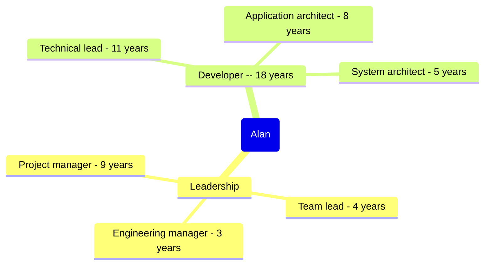

title: Prior Roles and Project Showcase
subtitle: Alan Ray Profile
status: hidden
slug: profile-experience-showcase
layout: page

[TOC]

One of the best parts of small, fast-moving companies is the chance to do what what is required, regardless of one's official title[^title]. Over the years, I've worn many hats, sometimes formally and often informally:

[^title]: One of the downsides of working for small startup companies is the necessity of doing what is required, regardless of one's official title. Another downside is that roles and titles don't keep up with reality.

# Spotlight Project: Billing System Overhaul

__The problem__: My company was using a custom in-house billing that had grown up around the existing business model and was deeply intertwined with current business practices. While the system was good at what it did, it was brittle:

* Testing changes prior to production was effectively impossible -- and changes hit all customers simultaneously.
* Common software-as-a-service operations such as custom pricing or discounts were difficult at best.
* Reports didn't live up to executive or accounting expectations.
* Rather than being modular, the custom software was hard-coded into at least five different systems, some of which were legacy systems.

The goal was to modernize the billing system by replacing the current in-house system with a third-party system. The project goals were something like:

* Modernize the system, bringing it up to best practices. It should be testable and maintainable; it should be trivially extensible to common billing models; it should readily provide executives, accounting, and other stakeholders with answers to their questions.
* Minimize the transition time when both systems were in place. Because the company had a large number of employees who interacted with the system, minimizing the period of time when employees were having to keep two different mental models in mind.
* Minimize the number of changes to billing. Again, because many employees interacted with the system, there was a strong desire for the new system to behave like the old way.
* Maintain business continuity -- customers should not be disrupted; billing needed to continue without interruption.

And that's where the project started -- an ambition, but no project plan, no technical details, no team.

## Outcomes

After selecting a third party-system (see more [here](./profile-professional-strengths#example-project-definition), my role was architect, team lead, project manager, and part-time developer. That meant everything From assembling the team to communicating with stakeholders to figuring out how to satisfy business requirements to ensuring that nothing broke during the course of the work.

Over the course of about a year, my team shipped a series of continuous delivery releases where the new billing system ramped up from small in-house tests to a small number of new customers to all new customers to a small number of migrated customers. Finally, a rapid migration of all customers happened in a period of about 45 days. This approach meant that over the course of a single billing cycle, the system transitioned 98% of subscriptions from the old system to the new one, successfully meeting the company's goal to minimize cognitive load for employees.

The new system was not only supported a robust staging environment, but also supported per-customer migration, allowing the company to roll out a price change or a new billing model and then chose how gradually or rapidly to transition. The third party-solution enabled the ability to generate quality reports as well as quickly extend the system for other models.

I built strong relationships with stakeholders, especially accounting and customer service. For example, I built real-time channels for communicating with customer service and deliberately trained them. As a result:

* The new system was far more efficient, requiring fewer hand-offs to accomplish common billing operations. First call resolution for billing-related calls rose from under 1% to over 95%.
* Customer service representatives had near real-time answers for complex scenarios, and bug fixes or wording improvements were often delivered within 2 days.
* Dozens of customer service representatives seamlessly switched from the old to new billing system in under a month.

At their annual award ceremony, customer service would go on to create their first (and to my knowledge, the only every) inter-department award for my team for having partnered well with them in transitioning between systems. The ongoing relationships would go on to help define future work, even after the initial project was complete, resulting in more responsive development.

Technically, the project solidified a number of new capabilities at the company, including highly-modular microservices, telemetry, pushing errors to developers, and controlled migrations. The work would proved to easily extensible: In the future, several key projects (such as [this one](./profile-professional-strengths#driven)) would take weeks rather than the months they would have taken in the old system. Common operations such as price adjustments moved from being a major all-hands-on-deck events to being 1-2 day operations that a single developer could do through normal build/test/release processes.

_What was one lesson you learned from this project?_ At the start of the project, I was handed a clear vision for the long-term non-functional behavior. My assumption was that these outcomes were firmly established in the company culture. The executives had set them, the company had invested in significant resources in overhauling the old system, and these requirements were critical to many future business plans. I didn't anticipate once the overhaul succeeded, everyone would forget about the long-term requirements. While I had documented the non-functional requirements, I hadn't done much work to deeply embed them into the company culture. The result was that by the time I realized that there was a problem, the long-term vision had largely been lost.

From that, I learned that truly transformational change needs to be far more deeply embedded than one successful project. People will move on, reorganizations will happen, crisis will occur. And the guiding principles of a critical system can't just be written down; they need to be understood by developers, by designers, by project planners, by senior leadership. And I learned that I needed to start effecting that kind of awareness from the start of the project.

# Projects

Here's a selection of major software projects that I've worked on.

## Live Algorithm Parameter Adjustment

__The problem__: A team at my company was responsible for monitoring and adjusting the behavior of a number of algorithms responsible for high-volume real-time text analysis. The modification tools were outdated, leading to a number of problems:

* A number of different tools were required, requiring complex and error-prone workflows as employees switched between tools.
* The tools frequently crashed, forcing employees to restart tasks.
* Employees could only validate changes by deploying modifications in production environments. Even then, differences due to regional differences could not be detected.

The project was to create a reliable streamlined workflow for the team.

### Outcomes

As architect and lead developer, the result was a robust webapp that supported a commit-style approach to making changes. The web tool allowed algorithm changes to be proposed, tested, and, if successful, deployed to production. While previous workflows had required multiple tools, a change was a fully self-contained set of actions, not only changing algorithms but also coordinating customer communications and various auxillary tasks. This approach meant that the history of algorithm changes was easily reviewed, which meant that if problems arose, recent changes could be rapidly reviewed.

This new web application would go on to be the only tool for controlling the algorithm for a number of years; it was so complete and robust that after it was completed, it never had an official team to maintain it. Instead, about once a year, someone from that initial team would hit the proverbial "reset" switch. The tool would go on quietly doing essential work for years without any additional development.

Technically, my contributions to the success of this work included:

1. Innovated after carefully understanding the problem. I realized that source control had already solved a similar problem, and convinced my team that a simple system to manage changes was not too hard for non-technical users to understand. Initially I explored the possibility of simply recording changes in Git. When that proved technically infeasible because of particulars to the project, I paired with a database expert to develop a specialized SQL to provide the necessary change management.

2. Introduced structure web applications to the company, demonstrating their efficiency, updatability, and sustainability. As a result of this, web applications would become the primary means for delivering future internal tools, and the company would go on to standardize around VueJS.

3. Leveraged the idea of dynamically creating databases in production in order to predict the effects of an algorithm change. This unorthodox approach was necessary because it was not possible to change that the algorithms were controlled through certain databases. However, it was possible was possible to run alternative instances of the algorithms against different databases.

4. Closely worked with user experience to rapidly deliver changes. Often, the most efficient approach was to give user experience a page with all the data they had requested and support user experience in directly making modifications to the code. This pairing resulted in rapid development of complex pages for controlling different algorithms.

_What was one lesson you learned from this project?_ Looking back, recreating the ability to do limited source control commits in SQL was incredibly clever and innovative. It was also a brittle solution; an intricate and complex section of code that was only understood by a few people. And as such, it was effectively unchangable code. In hindsight, I should have explored the possibility of outright just using git to do the source control operations, and then writing importers and exporters to move data between the git repository and the database. I suspect the result would have been a very boring solution, but one that could have been far more modifiable when the circumstances called for it.

## Slow deployments to nearly identical servers

__The challenge__: Software deployments were made by asking operations to checkout the code and build it on each of a couple dozen servers. Servers had no consistent configuration, and it was all too common for them to have slightly different library versions or some other "trivial" differences, resulting in a variety of failures. Rollbacks followed a similar process; on more than one occasion, something got tweaked so that a the rolled back server state didn't match the original condition.

!!!note "Aside"

    No, none of this is best -- or even good -- practice. But as the saying goes, you go to war with the army you have, not the army you want.

My team was trying to reliably deliver software on a frequent basis as much as possible, and the highly manual process, schedule coordination, and ongoing uncertainty around configuration was destroying the ability to deploy quickly or often. And when bugs were found, our mean time to recovery was horrific.

Furthermore, neither management nor senior technical leadership had much interest or experience in the problem. It wasn't worth resources -- let alone a project -- to implement changes.

### Outcomes

My solution was to do some quick research and prototyping with common solutions such as Chef, Puppet, and Ansible. (Terraform wasn't an option for various reasons.) I quickly realized a push-based approach was needed to match my department's culture. Ansible won by virtue by being a popular and solid product, written in a familiar language.

My next effort was a small proof of concept -- a few of the most crucial deployment steps executed on a few servers to prove the technology to my manager and other leaders. While I didn't persuade anyone to back a major initiative to use the new technology, I did get enough support to introduce Ansible as the defacto approach among my team.

Over the next months, I would teach Ansible to my team, leading to a series of iterative improvements. Anytime that a configuration needed to be changed, the goal was configure it through Ansible. Over time, we built up a sizable set of playbooks to control configurations. Some of our newer servers were fully configured via Ansible. And the most important and common operations were now identical across servers, controlled by code.

The improved standardization made it possible to have a standard way to deploy software, so for the first time, our continuous deployment system could deploy (and rollback software). This was a huge step forward as it meant that there was no longer any routine manual step in software deployment.

While there were setbacks such as getting bit by the dead object problem a few times and having to take a server offline while we figured out what the problem was, the wins were demonstrable. There was a history of server changes. Deployments were far faster and less stressful for developers. Changes could be rolled back in one or two minutes instead of tens of minutes.

Gradually my role shifted from implementation and advocating for configuration as code on my team to sharing what I knew with other teams. I took the time to write documentation and support others in making their changes with Ansible. Most other teams readily adopted Ansible (as it certainly beat out the alternative of manually configuring all the servers).

After a few years, we got near the point were most of the hundreds of machines were configured entirely via Ansible. Eventually, only a small -- and shrinking -- set of servers weren't fully configured via Ansible. There was never any major project or official line in the sand, but over time, Ansible became the way to do server configuration. And developers regularly deployed code to dozens of servers in minutes, confident a rollback would return systems to their original state.

_What was one lesson you learned from this project?_ Sometimes, a solution can last too long. Looking back, I suspect that the success and comfort of configuration as code through Ansible kept the engineering from adopting more modern practices such as Terraform or various cloud architectures. There were a lot of factors going into the decision to stick with Ansible, of course. And one doesn't want to abandon a working technology just because something cooler came out. But in hindsight, I wish I'd kept up more with alternatives and worked harder to move away from Ansible sooner.

## Monolith to Microservices

Problem description
What happened / Achievements
Lessons Learned

## Resurrecting a legacy app

## Navigation
## Always listening police radios

_The problem_: I was developing the radio control software for a computer that would be installed in police cars. When officers were in the field, it was essential that their radios worked. Officers carried short-distance radios, and relied on car-based installations to relay messages across the city. However, if more than one car acted as a rely, the transmissions interfere, rendering the communication unintelligible. So it was essential to always have exactly one police car acting as the relay, no matter how many police cars were on the scene. And if the car that was relaying messages drove away, another car needed to step in and relay messages.

Conveniently, another engineering team had provided me with a clear protocol for cars to negotiate the relaying car.

### Outcomes

My job was to implement

When officers are in the field, they need to be able to reliably

# Sustainables

Sometimes the important work isn't a concrete project, but growing people and systems across projects in significant ways.

## Team Growth
## Mentorship
## Hiring
## CI/CD System (BuildKite)
## High performance, high volume APIs

# Technical Roles

__Systems architect (5 years)__

My first noteworthy system design was the introduction of Ansible to hundreds of VMs, moving from a small prototype to a standard staple for a few developers to a department standard LINK. Eventually for a department of about 25 developers, I was planning long-term architectural direction based on business objectives while making short-term decisions that balanced ongoing engineering plans and immediate product asks while also aligning with individual developer capabilities and interests. My most significant work included replacing a legacy billing system with a modern compartmentalized one LINK, transitioning a legacy monolith to microservices LINK, and improving architecture practices across the department LINK.

__Application architect (8 years)__

The first two major applications I designed were a hazmat navigation system for commercial trucks LINK and a radio communication protocol for police cars LINK. And yes, I was terrified that someone would die because a police officer's radio wouldn't work in a critical situation. After that, I moved into building a web application that safely modified critical algorithms LINK, re-architecting a legacy MacOS application for sustainable development LINK, and designing (and building) an in-house CI/CD system from scratch LINK. One of my most recent projects has been a distributed application that measures the daily developer experience. LINK.

__Technical lead (11 years)__

Once I joined a company with a team-based approach, the role of technical lead was a natural fit. My leadership and mentoring LINK led to successful projects such as LINK and LINK and LINK. Part of what made me a great technical lead was that I saw from the big picture and the business objectives all the way to the technical implications of using an enum rather than constants. I organized the project work, communicated well with developers and managers, and broke big messy blocks of work into appropriately sized chunks when other developers struggled. I also started my journey on technical interviewing LINK, eventually running technical evaluation for a software team of 25.

__Developer (18 years)__

My professional developer career started at a small firm with a sink-or-swim environment: no hand holding[^mentor], everyone needed to carry their weight, mostly independent development. I was often the only person checking my code before it shipped. While I was a good coder going into the position, this work taught me the ins-and-outs of development such as error handling, debugging my own code, debugging live systems, validating requirements, and interfacing with undocumented[^under] components.

[^mentor]: I did have several very thoughtful and experienced mentors, though, who taught me much of what I know.

[^under]: Or under-documented. In one case, we got a specification for a complex state machine in Japanese. There are also misdocumented components, which are always fun to resolve.

# Leadership roles

__Project manager (9 years)__

I got my start in project management on a [highly technical project](#live-algorithm-parameter-adjustment) because of my ability to evaluate, plan, and break down work -- along with the ability to appropriately pivot when the unexpected happens. Since then, I've frequently managed projects, especially highly technical ones. These range from large-scale initiatives such as [overhauling a billing system](#spotlight-project-billing-system-overhaul) and successfully replacing a decades old monolith with microservices to smaller scale efforts such as  crisis projects such as [implementing new payment options in a few weeks](./profile-professional-strengths#driven).

 A few examples include:

* [A large-scale billing overhaul]
* [Overhauling deprecated APIs]

 are LINK LINK LINK.

__Team lead (4 years)__

The [billing project](./profile-experience-showcase#spotlight-project-billing-system-overhaul) was my first chance to run a team (as well as building it from scratch). From ceremonies to project cadence to supporting team members' goals, I led the team through from project inception to delivery and then transitioned it into a DevX team. This was a chance to test a lot of my theories of leadership, and I'm really pleased with how [they worked out](#team-growth) (see also [mentorship](#mentorship)). Through delegation, mentoring, and focusing on principles and goals, I passed on my strengths in independently prioritizing and executing. When I was unexpectedly away, the rumor was that my team was the most capable of all the teams at running itself, regardless of managerial oversight.

__People manager (3 years)__

Eventually I picked up the HR supervising responsibility for my team as well. Since I had a great team and already had practices such as supporting reports' goals and providing quality feedback, I found this transition was mostly a day-to-day formality. But I learned about behind-the-scenes processes such as corporate budgeting and hiring requisitions.
