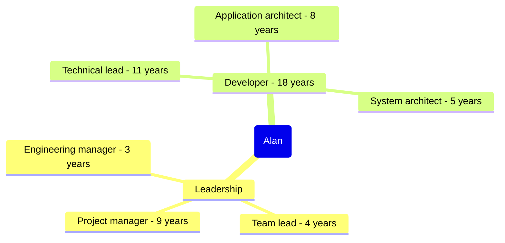

title: Experience Showcase
subtitle: Alan Ray Profile
status: hidden
slug: profile-experience-showcase
layout: page

[TOC]

One of the best parts of small, fast-moving companies is the chance to do what what is required, regardless of one's official title[^title]. Over the years, I've worn many hats, sometimes formally and often informally:

[^title]: One of the downsides of working for small startup companies is the necessity of doing what is required, regardless of one's official title. Another downside is that roles and titles don't keep up with reality.

This page showcases the value I bring in three roles:

* [Architect](#architect-showcase) - guiding and setting technical requirements in the context of business requirements
* [Solver](#solver-showcase) - diving into complex problems and finding a path forward
* [Team Growth](#team-growth-showcase) - enabling individuals and teams to be better engineers

# Spotlight: Billing System Overhaul

__The problem__: My company was using a custom in-house billing solution that had grown up around the existing business model and was deeply intertwined with current business practices. While the system was good at what it did, it was brittle:

* Testing changes prior to production was effectively impossible -- and changes hit all customers simultaneously.
* Common software-as-a-service operations such as custom pricing or discounts were difficult at best.
* Reports didn't live up to executive or accounting expectations.
* Rather than being modular, the custom software was hard-coded into at least five different systems, some of which were legacy systems.

The goal was to modernize the billing system by replacing the current in-house system with a third-party system. The project goals were something like:

* Modernize the system, bringing it up to best practices. It should be testable and maintainable; it should be trivially extensible to common billing models; it should readily provide executives, accounting, and other stakeholders with answers to their questions.
* Minimize the transition time when both systems were in place. Because the company had a large number of employees who interacted with the system, minimizing the period of time when employees were having to keep two different mental models in mind minimized the distraction and mental load for customer service and accounting.
* Minimize the number of changes to billing. Again, because many employees interacted with the system, there was a strong desire for the new system to behave like the old one.
* Maintain business continuity -- customers should not be disrupted; billing needed to continue without interruption.

And that's where the project started -- an ambition, but no project plan, no technical details, no team.

## Outcomes

After selecting a third party-system (see more [here](./profile-professional-strengths#example-project-definition), my role was architect, team lead, project manager, and part-time developer. That meant my work included:

* Setting and adjusting the project roadmap, both from a business and technical perspective.
* Assembling the team and building up team practices.
* Creating and maintaining a regular cadence for updating stakeholders with progress and changes to plans.
* Figuring out how to satisfy business requirements.
* Architecting not just the new systems, but also the plans for transitioning from the old system -- and the plans to validate those transition plans.
* Training the team on new approaches, such as microservices and gradual, controlled data transitions.
* Solving thorny problems such as idempotent webhook handling and ensuring transaction visibility to customer service.

Over the course of about a year, my team shipped a series of continuous delivery releases in which the new billing system ramped up from small in-house tests to a small number of new customers to all new customers to a small number of migrated customers. Finally, a rapid migration of all customers happened in a period of about 45 days. This approach meant that over the course of a single billing cycle, the system transitioned 98% of subscriptions from the old system to the new one, successfully meeting the company's goal of minimizing cognitive load for employees.

The new system not only supported a robust staging environment, but also supported per-customer migration, allowing the company to roll out a price change or a new billing model and then choose how gradually or rapidly to transition. The third-party solution enabled the ability to generate quality reports as well as quickly extend the system for other models.

I built strong relationships with stakeholders, especially accounting and customer service, developing real-time channels for communicating with customer service and deliberately training them. As a result:

* The new system was far more efficient, requiring fewer hand-offs to accomplish common billing operations. First-call resolution for billing-related calls rose from under 1% to over 95%.
* Customer service representatives had near-real-time answers for complex scenarios, and bug fixes or wording improvements were often delivered within 2 days.
* Dozens of customer service representatives seamlessly switched from the old to new billing system in under a month.

At their annual award ceremony, customer service would go on to create their first (and to my knowledge, the only ever) inter-department award for my team for having partnered well with them in transitioning between systems. The ongoing relationships would go on to help define future work, even after the initial project was complete, resulting in more responsive development.

Technically, the project solidified a number of new capabilities at the company, including highly modular microservices, telemetry, idempotent webhook processes pushing errors to developers, and controlled migrations. The work proved to be easily extensible: later on, several key projects (such as [this one](./profile-professional-strengths#driven)) would take weeks rather than the months they would have taken in the old system. Common operations such as price adjustments moved from being major, all-hands-on-deck events to being 1-2 day operations that a single developer could do through normal build/test/release processes.

_What was one lesson you learned from this project?_ At the start of the project, I was handed a clear vision for the long-term non-functional behavior. My assumption was that these outcomes were firmly established in the company culture. The executives had set them, the company had invested in significant resources in overhauling the old system, and these requirements were critical to many future business plans. I didn't anticipate that, once the overhaul succeeded, everyone would forget about the long-term requirements. While I had documented the non-functional requirements, I hadn't done much work to deeply embed them into the company culture. The result was that by the time I realized that there was a problem, the long-term vision had largely been lost.

From that, I learned that truly transformational change needs to be far more deeply embedded than one successful project. People will move on, reorganizations will happen, and crises will occur. And the guiding principles of a critical system can't just be written down; they need to be understood by developers, by designers, by project planners, by senior leadership. And I learned that I needed to start effecting that kind of awareness of change from the start of the project.

# Architect Showcase

Beyond the [billing overhaul](#spotlight-billing-system-overhaul), here are examples of my architecture work across systems with a major business impact.

## Live Algorithm Parameter Adjustment

__The problem__: A team ("ProductUser") at my company was responsible for monitoring and adjusting the behavior of a number of algorithms responsible for high-volume real-time text analysis. The modification tools were outdated, leading to a number of problems:

* A number of different tools were required, requiring complex and error-prone workflows as employees switched between tools.
* The tools frequently crashed, forcing employees to restart tasks.
* Employees could only validate changes by deploying modifications in production environments. Even then, differences due to regional differences could not be detected.

The project goal was to create a reliable, streamlined workflow for the team.

### Outcomes

With my work as architect (and lead developer), the result was a robust web app that supported a commit-style approach to making changes. The ProductUser team found their workflow dramatically more efficient; while the number of incoming requests would double in the coming years, the team size slightly shrank due to the improved efficiency. On the handful of occasions where an error made it into the production system, it was quickly identified and reverted, thanks to excellent visibility into past changes. And because of its robustness, the application itself didn't even require a maintenance team (as demonstrated by the fact that it would go years without a maintenance team or significant incident).

One of the big technical decisions contributing to these business results was that the web tool alone allowed algorithm changes to be proposed, tested, and, if successful, deployed to production. While previous workflows had required multiple tools, here a change was a fully self-contained set of actions, not only changing algorithms but also coordinating customer communications and various auxiliary tasks. This approach meant that the history of algorithm changes was easily reviewed, which meant that if problems arose, recent changes could be rapidly examined for issues.

This new web application would go on to be the only tool for controlling the algorithm for a number of years; good design and anticipation of possible error scenarios led to a robust design such that after it was completed, it never had an official team to maintain it[^reorg]. Instead, about once a year, someone from that initial team would hit the proverbial "reset" switch. The tool would go on quietly doing essential work for years without any additional development.

[^reorg]: During original development, the intent was for the application to have ongoing maintenance and eventually grow into a big system. However, shifting priorities and company reorganizations eventually led to the application remaining a critical part of the business but without a clear owner.

Technically, my contributions to the success of this work included:

1. Innovating after carefully understanding the problem. I realized that source control had already solved a similar problem and convinced my team that a simple system to manage changes was not too hard for non-technical users to understand. Initially, I explored the possibility of simply recording changes in Git. When that proved technically infeasible because of particulars to the project, I paired with a database expert to develop specialized SQL queries to provide the necessary change management.

2. Introducing structured web applications to the company, demonstrating their efficiency, updatability, and sustainability. As a result of this, web applications would become the primary means for delivering future internal tools, and the company would go on to standardize around VueJS.

3. Leveraging the idea of dynamically creating databases in production in order to predict the effects of an algorithm change. This unorthodox approach was necessary because it was not possible to change the algorithms being controlled through certain databases. However, it was possible to run alternative instances of the algorithms against different databases.

4. Closely working with user experience to rapidly deliver changes. Often, the most efficient approach was to give user experience a page with all the data they had requested and support user experience in directly making modifications to the code. This pairing resulted in rapid development of complex pages for controlling different algorithms.

_What was one lesson you learned from this project?_ Looking back, recreating the ability to do limited source control commits in SQL was incredibly clever and innovative. It was also a brittle solution: an intricate and complex section of code that was only understood by a few people. And as such, it was effectively unchangable code. In hindsight, I should have explored the possibility of outright just using Git to do the source control operations and then writing importers and exporters to move data between the Git repository and the database. I suspect the result would have been a very boring solution, but one that could have been far more modifiable when the circumstances called for it.

## Slow Deployments to Nearly Identical Servers

__The challenge__: Software deployments were made by asking operations to check out the code and build it on each of a couple dozen servers. Servers had no consistent configuration, and it was all too common for them to have slightly different library versions or some other "trivial" differences, resulting in a variety of failures. Rollbacks followed a similar process; on more than one occasion, something got tweaked so that a rolled-back server state didn't match the original condition.

!!!note "Aside"

    No, none of this is best -- or even good -- practice. But as the saying goes, you go to war with the army you have, not the army you want.

My team was trying to reliably deliver software on a frequent basis as much as possible, and the highly manual process, schedule coordination, and ongoing uncertainty around configuration was destroying the ability to deploy quickly or often. And when bugs were found, our mean time to recovery was horrific.

Furthermore, neither management nor senior technical leadership had much interest or experience in the problem. It wasn't worth resources -- let alone a project -- to implement changes.

### Outcomes

_What was the business impact of my work?_

* Code and server changes deployed in minutes rather than requiring coordinated hours of multiple engineers. Not only did this reduce the time required, but it enabled far more frequent deployments with smaller changes, improving reliability (see CI/CD philosophy).
* Enabled rapid rollback of changes, reliably reducing mean-time-to-recovery to minutes rather than the manual back-and-forth attempts to revert changes and then asking, "Did that fix it?"
* Equipped much of the engineering team, rather than a handful of individuals, significantly reducing server configuration as a development bottleneck.

_How did I get there?_

My solution was to do some quick research and prototyping with common solutions such as Chef, Puppet, and Ansible. (Terraform wasn't an option for various reasons.) I quickly realized a push-based approach was needed to match my department's culture. Ansible won by virtue by being a popular and solid product, written in a familiar language.

My next effort was a small proof of concept -- a few of the most crucial deployment steps executed on a few servers to prove the technology to my manager and other leaders. While I didn't persuade anyone to back a major initiative to use the new technology, I did get enough support to introduce Ansible as the de facto approach among my team.

Over the next months, I would teach Ansible to my team, leading to a series of iterative improvements. Anytime a configuration needed to be changed, the goal was to configure it through Ansible. Over time, we built up a sizable set of playbooks to control configurations. Some of our newer servers were fully configured via Ansible. And the most important and common operations were now identical across servers, controlled by code.

The improved standardization made it possible to have a standard way to deploy software, so for the first time, our continuous deployment system could deploy (and roll back) software. This was a huge step forward, as it meant that there was no longer any routine manual step in software deployment.

While there were setbacks, such as getting bit by the dead object problem a few times and having to take a server offline while we figured out what the problem was, the wins were demonstrable. There was a history of server changes. Deployments were far faster and less stressful for developers. Changes could be rolled back in one or two minutes instead of tens of minutes.

Gradually my role shifted from implementation and advocating for configuration as code on my team to sharing what I knew with other teams. I took the time to write documentation and support others in making their changes with Ansible. Most other teams readily adopted Ansible (as it certainly beat out the alternative of manually configuring all the servers).

After a few years, we got near the point where most of the hundreds of machines were configured entirely via Ansible. Eventually, only a small -- and shrinking -- set of servers weren't fully configured via Ansible. There was never any major project or official line in the sand, but over time, Ansible became the way to do server configuration. And developers regularly deployed code to dozens of servers in minutes, confident a rollback would return systems to their original state.

_What was one lesson you learned from this project?_ Sometimes, a solution can last too long. Looking back, I suspect that the success and comfort of configuration as code through Ansible kept the engineering from adopting more modern practices such as Terraform or various cloud architectures. There were a lot of factors going into the decision to stick with Ansible, of course. And one doesn't want to abandon a working technology just because something cooler came out. But in hindsight, I wish I'd kept up more with alternatives and worked harder to move away from Ansible sooner.

## Sustaining High-Availability, High-Volume APIs and Data Pipelines

Sometimes the important work isn't a concrete project, but growing people and systems across projects in significant ways.

__The setup__: For a number of years, I had been the caretaker of an important but languishing high-volume API (billions of database records per month, millions of API calls per day) that was foundational to the company. I'd gotten the system to the point where it was incredibly stable, but it was outdated -- it had substandard logging, little telemetry, and some of the clients were known to depend on unintended "quirks" (one might say bugs) in the API implementation. And without active development, the institutional knowledge faded and eventually the end of security support meant that the last responsible moment to make a decision had arrived[^decision].

[^decision]: This idea of waiting until the last responsible moment to make a decision is a favorite of mine in Agile development -- it captures both the benefit of delaying decisions to gain more understanding and avoiding unnecessary decisions while also recognizing that at some point indecision is irresponsible, leading to greater risk than making a reasonably informed opinion.

At the time, I was managing a team and also doing much of the software architecture. I ended up tasking my team with the upgrade. One of my goals was not only to upgrade the API in a seamless manner, but also to use the opportunity to work with one of my newer developers and help him gain some hands-on experience in migration strategies.

### Outcomes

At the end of the project, the old code had been successfully replaced with a modern implementation based on the company's standard approach to microservices. This meant that the common tooling such as CI/CD, logging, and telemetry now functioned with the API. Not only did this make the code base far more accessible within the company, but it significantly improved the visibility into the system and made it far easer to deploy and revert changes.

The project had been completed seamlessly with no abnormal customer interruptions. My team successfully implemented a twist on the [strangler pattern](https://microservices.io/patterns/refactoring/strangler-application.html) where we'd not only slowly strangled the old system, but also run many of the operations in both systems and done side-by-side comparisons to ensure no unexpected changes in behavior were introduced. Finally, a combination of improved error visibility in the new system, careful reading of the old code, and my institutional knowledge meant that most -- if not all -- of the undocumented quirks in the old system had become carefully documented features in the new system, complete with notes about which client versions relayed on each behavior.

And I had successfully passed my knowledge and understanding on to my team; I was not the primary author on any of the code. I did my fair share of talking through problems, pointing people at examples, diagramming concepts, and reviewing code, but the actual development had been successfully done by other engineers with significantly less institutional knowledge and experience than myself.

_How did I get there?_

Keys:
  - Evaluated talent and hired well.
  - Enough time for the project (including learning).
  - Careful selectino of key techniques (common microservice, error visibility, strangulation pattern, controlled rollouts of change).
  - Incremental development practices.
  - Being available to coach and mentor through challenges; finding the right balance between explaining principles, actual solutions, pointing people in the right direction, and letting people struggle.
  - Having a small amount of fault tolerance.
  - Ability to call the original system.
  - Prioritizing the most common routes first (long-tail aproach).

_What was one lesson you learned from this project?_ Great architecture isn't a design that I can execute; it is a design that a less-experienced developer can successfully execute.

When I was a young developer, I thought the best projects were the ones where I got to write the most complicated code. I eventually realized that I could write and successfully ship extremely complex code -- and that nobody could modify or maintain it. In some cases, I couldn't decipher it if enough time had passed. And I learned that, while some problems may demand complex solutions, a great developer writes code that others can easily read and modify.

This project hammered that lesson home for me on a larger scale. The goal isn't just to make good software architectures; the goal is to make architectures that can be easily and reliably implemented by others, especially those with less experience. And ideally, the key decisions are hard to accidentally bypass. For example, if the architecture requires someone to explicitly declare who is not allowed to access an API, someone will forget to block access. Far better to require allowing access so that if the developer forgets, there's no information leakage.

## Monolith to Microservices

__The setup__: A company had a large monolith, portions of which dated back to the start of the company. Over time, the company shifted its hiring strategy and there were few developers who had the ability to work on the monolith, especially not in the critical sections that required both an eye for performance and memory management (and pointers). And the testing wasn't adequate to the outsized role the monolith played in the company's systems. The result was that developers steered clear of the monolith, which meant less familiarity, which meant even fewer developers working in it. Developers working elsewhere on important projects naturally drew the attention of management, pulling attention away from the monolith and leading to further neglect. This situation, then, created significant business risk if an update or change was required, and that risk was growing with time.

### Outcomes

Working as architect and technical lead, I spearheaded a number of efforts, the culmination of which was the retirement of the monolith.

My first major effort was a spectacular failure: I made the argument to engineering leadership that the monolith needed to be properly owned and maintained, that its functionality was critical to business continuity, and that we faced significant risks as we lost expertise in maintaining and updating it. However, I'd underestimated the opportunity costs and competing business pressures, and I wasn't able to effect any lasting change.

My second effort was pairing with another developer on a very short project that served as trial run for microservices. The project was a small internal standalone web application, a perfect way to try out microservices in a tech stack that was highly familiar to most of the company's developers. This project highlighted the strengths of microservices -- the ability for small teams to move very quickly. As a result of this work, there was significant support for a similar approach in future work.

My next effort was more substantial -- a number of high-availability microservices, some of which were customer facing. The main goal here was to establish the practice of working with microservices and set up the supporting infrastructure, such as telemetry, logging, and distributed tracing. Along with that came corresponding development practices, such as rapidly creating and deploying microservices. In and of itself, this step had very little impact on the monolith, perhaps moving or duplicating small amounts of functionality. But it laid the groundwork for microservices to be the go-to software pattern for development.

Around the same time, I wrote up a plan for sunsetting the monolith. Some pieces needed to be replaced in a particular order. Some pieces could foreseeably be retired. Other parts could be pulled out as distinct services. The trickiest portions of the monolith needed to be carefully [strangled](https://microservices.io/patterns/refactoring/strangler-application.html).

Once the plan was written, conceptual approval came pretty easily since the plan was now far better aligned with the technical culture -- many small projects that were far better matched to the typical skillsets of recent hires. From there, my main effort was making sure that progress was being made on the plan. Sometimes that meant prioritizing a particular project, but most often it was sitting down with developers to talk through the particulars of some piece of work to ensure that it encompassed what was needed to continue deprecating the monolith. At other times, it meant working with product to understand what product wanted so that the necessary monolith behaviors were replicated or improved upon, but unnecessary behaviors could be slowly phased out.

Thus, over the course of a few years, the monolith shrank and disappeared. Instead, a number of highly available microservices offered the necessary functionality with significantly better support in areas such as logging, telemetry, and deployment speed.

_What was one lesson you learned from this project?_ Sometimes culture dictates the correct tech strategy. I read various perspectives about microservices, their advantages, their costs, their complexities. And I'm certainly not sold on microservices being right in every situation. I'm not even convinced they were the best technical solution in this situation. But in a culture that highly valued small, iterative changes and hiring developers with a particular set of skills, microservices provided a robust way to eliminate risk and create sustainable software in a way that other alternatives (say, writing another monolith in a different language) would have fallen short.

# Solver Showcase

## Always-Listening Police Radios

_The problem_: I was developing the radio control software for a computer that would be installed in police cars. When officers were in the field, it was essential that their radios worked. Officers carried short-distance radios and relied on car-based installations to relay messages across the city. However, if more than one car acted as a relay, the transmissions interfered with one another, rendering the communication unintelligible. So it was essential to always have exactly one police car acting as the relay, no matter how many police cars were on the scene. And if the car that was relaying messages drove away, another car needed to step in and relay messages.

Conveniently, another engineering team had provided me with a clear protocol for cars to negotiate the relaying car.

### Outcomes

Unfortunately, the provided protocol assumed that radios transmitted messages instantly and constantly listened for incoming messages. My testing of the actual hardware revealed that the actual radios took around 50ms to power up to transmit the message and another 10ms or so to cool down. During this 60ms transmission window, the radio was completely blind to incoming messages. This meant that two cars could both send a message and neither would be aware that the other one had sent a message.

Once I had assessed the problem, I redesigned the protocol from scratch with an algorithm so that cars that thought they were the car responsible for relaying messages had a retry mechanism with a gradual backoff (similar to TCP/IP packets). This approach had the effect of rapidly deconflicting multiple cars that had simultaneously decided that they were responsible for relaying messages.

After the protocol was redesigned, I explained the problem and my solution to the project managers. This was non-trivial, as there was a fair amount of bureaucratic overhead to make sure everything complied with the government regulations as well as the contract. For example, because of the officers' reliance on this radio relay behavior, it was important that the solution be robust and not have rare failure scenarios. In the end, I persuaded everyone that my solution was a good one[^captheorem] and it would go on to pass accreditation and be put on the road in actual police cars.

[^captheorem] The hardest part of the conversation was helping people understand that events were (a) not instantaneous, and (b) it wasn't possible to align event timings or guarantee the same event orderings for all cars. Basically, an application of the [CAP theorem](https://en.wikipedia.org/wiki/CAP_theorem), except applied to a dynamic network of police cars instead of a distributed database.

_What was one lesson you learned from this project?_ Everything takes time to occur, whether it is the event itself or transmission. In many scenarios, events are better modeled with a start and and end time than a single time. And be very wary if multiple independent machines need guaranteed agreement upon an ordering of events; the real world can generate some very interesting edge cases, such as two simultaneous radio transmissions where two different receivers each hear a different one of the transmissions. Conveniently for software developers, though, most events in software development aren't life-or-death scenarios and exact ordering doesn't actually matter.

## Truck Logistics - HAZMAT-Based Navigational Guidance

__The problem__: My company wanted to sell an in-cab infotainment system for commercial trucking. One of the features was navigation guidance that followed the federal HAZMAT regulations. A trucker would enter their cargo classification along with details about the truck (e.g., size, number of axles) and the system would provide the best legal route to the destination. Since there were significant penalties for breaking these rules, this functionality was valuable to truckers.

However, there was no HAZMAT-equipped navigational system. Instead, I got the following:
* The source code to a navigation system which could be extended.
* Best-effort support for the navigation system, which meant that I got help when it was easy and convenient.
* A bunch of files describing roads across the United States and their restrictions.
* 2 gigabytes of space in the infotainment system to store the HAZMAT routing specifications.

One of my first discoveries was that the navigation source code was exceptionally difficult to work with. The first reason is that it relied on extensive domain-specific knowledge. For example, roads were often represented as segments, which didn't correspond one-to-one with what a user would consider to be a road. Secondly, the code heavily used acronyms and abbreviations. And finally, the best-effort support meant that there wasn't help to tutor me through the basics. Oh, and nobody else in my company knew anything about this area either.

### Outcomes

What would ship a few months later, though, was a reliable navigation system that followed HAZMAT regulations and had a few megabytes of space left to spare. And the process for building the regulations was repeatable, allowing me to ship several map updates in the following years. Behind that accomplishment were three significant steps:

__First, I managed to find a few key areas where my interests aligned with the navigation supply.__

1. The first was a custom hook that got called for each segment (think "portion of road") to modify that segment's weight. By adjusting the weight for that segment, it would be more or less likely to be taken by the navigation system.
2. The second was some sample code showing how to convert between segments and roads. This gave me the insight I needed to convert the road-based HAZMAT regulations into their corresponding segments.
3. A few fixes for some bugs I found along the way.

__Secondly, I wrote a custom compression algorithm.__

Some initial math on the number of road segments, the number of truck configurations, and the number of restrictions showed that while the information could be stored in 2GB, it was going to be very tight. Fully compressing the files wasn't an option -- the embedded device didn't have nearly enough memory to store decompressed versions, and constantly decompressing for each segment would be too big of a hit to performance. Navigation performance was already an issue, and significant additional processor load wasn't a viable option.

Instead, I took the concept of a traditional hash map, mapping from road segments to HAZMAT regulations. Then I started creatively adapting the standard hash map approach. The size of the hash map, for example, was calculated on a territory-by-territory basis (each state of some number of territories) to be just large enough to contain all of the segments for that territory. Because the hash maps were nearly full, collisions were common. I found tricks to avoid needing to store each value separately, instead reusing values for colliding keys when the values were shared. Smart defaults were used -- if no entry was found, use the default value. In some cases, I used secondary lookup tables to better group similar entries together and avoid redundancy.

__Finally, I wrote long-running Python processes to "compile" the HAZMAT regulations.__

Implementing the decompression algorithm in C++ was pretty straight forward. Given a road segment, truck configuration, and cargo, open the corresponding file, and start following through the lookup table until one encountered the appropriate segment weight or didn't find an entry (which implied to use the smart default from that point in the table).

However, creating the compressed files was another story. The navigation library came with Python bindings, and I built a multi-stage sequence to extract all of the possible road segments from a territory, map those to the corresponding regulations, and then figure out which compression tricks to use on the resulting collection. The initial process was slow (on the order of months), so I parallelized processing each territory, which got the time down to about three weeks.

There were other complications as well -- some territories had so many segments that the 32-bit version of Python couldn't hold all of the objects. But the 64-bit version of Python crashed due to excessive memory usage on certain steps. This situation led to my streamlining the process by removing valuable debugging and logging information. And even then, I swapped back and forth between the two versions of Python depending on the stage. But in the end, the compressor could handle any of the territory files.

!!! note "Context"

    1. For perspective, this work took place before common cloud computing solutions such as AWS or modern tooling for large-scale data processing.
    2. There are some obvious improvements to this work -- rewriting the compression algorithm in a more efficient language certainly would have solved the memory problems, for example. However, the compression algorithm was far faster to develop in Python and the memory problems were discovered late in development. Given that they could be worked around, it was really hard to justify a significant rewrite for a process that was only going to be needed a few times.

_What was one lesson you learned from this project?_ Often, the solution only needs to work; it doesn't have to be pretty or handle all possible scenarios. Swapping between the 32-bit and 64-bit versions of Python was effective, but it isn't great system design. The compression algorithm wasn't guaranteed to work on any possible territory; it was proven to work on that particular map data for the United States. More roads or different regulations or new types of trucks could have easily crossed the 2GB threshold. But none of those hypotheticals mattered for this work. And an important part of software development is understanding what needs to work, what needs to fail in a controlled manner, and what can be ignored.

## Operationalizing Machine Learning Model

__The setup__: Another team had developed a machine learning model for analyzing a snapshot of customer data. Feed it a snapshot, and it would return an evaluation -- let's say thumbs up or thumbs down. Now the product for customers didn't want to evaluate single snapshots of customer data; it wanted to pass in a stream of snapshots and get a thumbs up / thumbs down for the stream as whole[^whole]. To top it off, the data stream varied by platform. So the behavior on, say, an Android phone might be very different from the stream on a desktop computer.

[^whole]: While one approach might have been to train the learning model on more than one snapshot, that approach wasn't considered viable for a variety of reasons such as complexity of training data and computational complexity.

### Outcomes

My project was to figure out how to feed the stream of snapshots into the machine learning model, and then summarize the model's output in a way that quickly answered the question: Is additional human attention needed on this data stream? For this particular model, false positives were a particular concern because they could undermine customer confidence.

To solve this problem, I built a conversion system with four distinct parts:

- A library of sample data streams. These allowed me to see how different algorithms would likely play out with actual customers.
- A standardization process for each platform to normalize the platform-specific data streams into a common format -- the one that the machine learning model had been trained on. By normalizing the data streams first, the rest of the process could be shared across platforms and tested/evaluated as a whole[^commonformat].
- An algorithm with several adjustable parameters for parsing a stream of snapshots into a set of snapshots to feed into the model, and then to summarize the model's output as a up/down outcome.
- Graphs that showed different input parameters for the algorithm and the corresponding algorithm accuracy and false positive rate.

[^commonformat]: This was an architectural choice with significant trade-off. On the one hand, it sped up development, minimized the testing resources (which were extremely limited), and standardized the system's behavior in most circumstances. On the other hand, it meant that any bugs in the platform-specific portion of the system could easily go undetected, as testing focused on the behavior of the standardized system rather than the behavior of the system as a whole.

The last output was particularly critical to product, as it allowed them to minimize false positives, which in many cases was more important than maximizing accuracy. It also gave product important insights into the typical behavior of the system as a whole, which helped them prioritize development priorities as well as fine-tune how customers interacted with the system to better set customer expectations. As a final benefit, the algorithm adjustment process could be easily rerun as the machine model changed. As a result, product was able to upgrade its machine model multiple times with only a few days of development resources spent to update the system around the model.

Two milestones I'm particularly proud of with this system -- first, when it released and replaced a different system, customer sentiment stayed consistent or increased. Secondly, the conversion system would go on to be used by customers for years without being significantly changed.

_What was one lesson you learned from this project?_ Operationalizing the solution is part of this problem. Initially, developing the machine learning model was considered to be the hard part and little concern was given to the final user experience. But it turned out that the challenging work of building a conversion system that provided the expected input to the model and then converted multiple fuzzy results to single results in a way that seemed natural to humans was a critical part of the customer experience. That is, because people bring their own expectations, what might be an acceptable behavior in an algorithm can be very unwelcome when encountered by a person. And since unhappy people don't tend to be recurring customers, that's very much a product problem. So it's important to view the problem from the perspective of the entire customer experience; a clever algorithm by itself isn't very useful.

# Team Growth Showcase

One of the best compliments I have received was being told, after I'd been unexpectedly away for a couple of weeks, that my team of six was doing great and probably the most capable team in the department when it came to operating independently.

How did I do that, especially when the manager role was only one of several hats that I was wearing? I did it by focusing on a handful of activities:

1. Making sure each team member knew the business outcomes we were aiming for.
2. Teaching each team member outcome-prioritized decision making and then backing them through the learning experience.
3. Knowing the work they did and being able to give specific, detailed feedback.
4. Guiding them to work that aligned with their interests and important business outcomes.
5. Making sure key knowledge gaps were addressed through mentoring or other means.

I've [written elsewhere](../my-best-managers.md) about my best managers. With limited time, my goal was to equip my team with the information and tools they needed to make good independent decisions, make sure they could get the help they needed, and make sure their successes and growth were reflected in their reviews (and compensation adjustments).

The result is that the team got a lot of practice in independent decision making and prioritization. Often we'd talk about priorities, long-term goals, and trade-offs, both in one-on-ones and team meetings. The result was that the team had a firm understanding of the desired business outcomes. Because everyone on the team routinely made prioritization decisions, they also got experience in rapidly adjusting when something went wrong (e.g., that "short" task kept expanding and expanding) and dealing with tough decisions like understanding how much of a complex system needed to be understood before it was safe to make changes. And while mistakes were made, the ongoing conversations meant that mistakes were relatively small (a day or two) and adjustments happened quickly.

With the business priorities established, many of the day-to-day routines were led by team members. This led to robust discussion about how the team worked, such as at retrospectives, "lunch-n-learns" (which were rarely actually at lunch), and planning meetings. As a result, when I was away, the team already was in the habit of being highly independent, figuring out what was the most important work, and getting it done.

## Mentorship

I've spent over a decade in roles where I've had the opportunity to help less experienced developers, including helping one would-be engineer learn to program, helping several engineers gain entry-level positions, and seeing at least two of those engineers mature into senior developers.

While there are many approaches to mentorship, my approach focuses on:

1. Understanding why a developer is making the choices they are.
2. Teaching to gaps in understanding.
3. Giving work such as projects that stretch someone's capabilities without burying them.

While it's often easy to identify a bad practice, it's often more important to understand why the practice is happening. Is there part of the business context missing? Is the developer prioritizing speed over quality? Or perhaps overly concerned with making mistakes? Maybe the developer doesn't know about a language feature which would simplify this problem or just copied and pasted code from somewhere else. Knowing the answer to why the decision was made informs the follow-up conversation. If a developer is rushing through a problem despite knowing how to write more reliable solutions, I want to have conversations to better understand the urgency of the work and perhaps help the developer manage upward. If the developer copied and pasted code without recognizing the weaknesses, perhaps the conversation is more about how to assess code before copying it.

My second goal is to teach to understanding gaps. While there are many good resources already available, it isn't always easy to find one that meets a particular gap. And I've found that with the variety of backgrounds developers come from, missing a concept -- perhaps algorithm efficiency or memory management or parallel processing -- is very common. Ideally, there's already a good resource I can point people at. But sometimes nothing beats a one-on-one conversation about the concept. This approach especially pays dividends when there someone is missing a a series of dependent concepts, like a Russian nesting doll: APIs are confusing because the concept of server/client communication doesn't make sense because the understanding of where code is executed was never grasped. In that scenario, pointing someone at a REST API primer is actually worsening the situation; it's more important to dig through the layers to provide a conceptual framework, then point them at additional resources.

My final goal is to give projects that stretch people's skills without drowning them. I often tell people this is my style, and that if I've mis-estimated either their abilities or the project complexity, please come back and we'll work on a better scope for the work. (Recognizing when a problem is out of one's depth is another important skill in software development.) While some developers don't like this approach, I find that for most developers, this approach helps them rapidly grow, especially when they know they have help when they need it.

## Hiring

As primary technical interviewer for over four years, significant accomplishments included:

* For over 90% of hires, hiring managers strongly agreed that my pre-hire technical assessment of candidates was accurate.
* The percentage of female software developers increased from 0% to 20% through revamping the process and improved technical assessments.
* The interview questions I designed could quickly scale with candidates' experience levels.

With over ten years of experience running technical interviews, these sorts of outcomes came about through:

__1. Designing adaptable problems.__

One of my best moves was to adjust both the initial technical screening as well as the on-site technical assessment questions to focus on open-ended "mini-projects" rather than a series of in-depth knowledge questions (e.g., "Tell me about dependency injection").

The biggest advantage of this approach is that the problems scaled to the applicant's experience. If entry-level developers floundered at the initial complexity, they could be quickly guided into a series of smaller, more accessible sub-problems. Likewise, more experienced developers could be evaluated on system design aspects -- how well did they account for edge cases? Did they consider issues such as testability or operationalizing the solution?

The result was a problem that allowed most candidates to show off how they would approach a problem and their understanding of many aspects to day-to-day engineering. Augmenting these problems with a small number of knowledge-based questions allowed me to double-check my assessment.

Additionally, this approach was a significantly better fit for the company's hiring profile, which didn't require a lot of pre-existing specialized knowledge.

__2. Assessing learning capability.__

For each candidate, I attempted to:

1. Introduce the candidate to a new concept and see how they react.
1. Push back against some assertion made by the candidate.

My goal was to understand how a candidate approaches learning and disagreement. Did they ask questions? Did they seek to understand? Could they process and apply new information? Especially for more experienced developers, could they support their ideas while also acknowledging weak points and other alternatives?

While this approach has some limitations (it works much better when candidates are relatively relaxed in the interview; some people aren't good at thinking on their feet), I've found it significantly helps showcase some candidates, especially when the company is looking for strong generalists. One entry-level candidate, for example, got hired largely because of their ability to rapidly learn new information and apply it to the interview question. A more rigid "answer this problem" approach would have completely overlooked their ability to learn and missed out on an excellent employee.

__3. Drawing people out about their experiences to highlight hidden strengths.__

For better or for worse, many excellent engineers do not excel at communicating their strengths -- and hiring processes often don't help showcase an engineer's experience, especially when it doesn't fit into an expected box.

As a generalist with multi-disciplinary interests, I made a point to encourage and explore portfolios, public projects, and unusual backgrounds. In one case, it meant catching someone's ability to blend a talent for user experience into their software development. In another case, it was recognizing some of the clever techniques in a student's personal passion project. In other cases, it was drawing someone out about their expertise in non-relational databases.

_What was one lesson you learned from this work?_

The best approach for effective technical assessment of candidates is highly dependent on the rest of the hiring pipeline.

* What is the company's long-term technical strategy? What are the implications for hiring?
* Is the company's goal to hire a few really skilled candidates or lots of mediocre candidates?
* How able and willing is the company to let people go if the technical assessment is wrong?
* Does the company want generalists who can learn any technology, or does it prefer to hire specialists with prior experience in specific areas?
* How large is the applicant pool?
* How capable are hiring managers at identifying the necessary job skills?

For example, a hiring approach that works really well to find great generalist candidates for a company with a relatively small applicant pool may be completely terrible for a company looking for very specific expertise from a lot of applicants.
