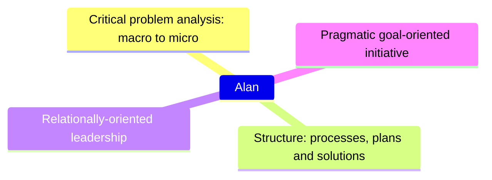

title: Professional Strengths
subtitle: Alan Ray Profile
status: hidden
slug: profile-professional-strengths
layout: page

[TOC]

> I see that right thing is efficiently built in the right way at the right time.
>
> I simplify what the right thing by changing the world around it.
>
> I make the next time easier.
>
> _Alan, three sentences on what he does best._

Some of biggest accomplishments in my career are what wasn't done. Proposals that were abandoned when it become clear that the projects were far more complex than anticipated. Plans for months than were trimmed down to weeks because the core need could be met far more simply. Complex algorithms replaced with a bit of syntactic sugar around existing tooling.

For me, this is part of [100x engineering](https://www.stxnext.com/blog/software-development-productivity-100x-engineering/). This page recaps the strengths I bring beyond just technical proficiency. These pages may also be useful context if you haven't already seen them:

* [What others say about me](./profile-interview-answers#what-would-others-say-about-you)
* [How to best leverage my strengths](./profile-target-position)
* [Highlighted projects](./profile-roles-n-achievements#spotlight-project-billing-system-overhaul)

# Critical problem analysis, macro to micro

> What would you do if you were your nemesis?
>
> _Alan's algorithm complexity analysis instructor_

Two of my favorite college classes were algorithm complexity analysis (e.g. Big-O notation) and a graduate game theory class that look at various proposals such as charging for e-mail and figuring out how much each e-mail would have to cost before spam would cease to be profitable[^profit].

[^profit]: It turns out to be a surprisingly high number -- dollars, if I recall correctly -- and would effectively break many legitimate uses of e-mail. This perhaps explains why pay based e-mail systems haven't taken off -- and why spam remains a nuisance.

Both classes rewarded my ability to understand a system and find edge cases. What's the worst that an algorithm can perform? Well, design just the right set of inputs to maximally thwart what it is trying to do.

> Alan is exceptionally talented at thinking about all aspects of a problem and having a good understanding of situation that is relayed to him. It seems to be easy for him to even grasp the complexity of subjects he is not familiar with at a glance.
>
> _Anonymous coworker praise_

From engineering process plans to system design documents to individual functions, spotting holes, edge cases, and assumptions.

At a macro level, it's questions like:

* If the goal is to just evaluate a bunch of images, why not read those images in from the data pipeline into their own isolated system? Because given the stated business objectives, we don't need all the proposed complexity for tying the results back into the data pipeline, including being able to correct the results downstream when they are initially incorrect.
* This plan seems to assume all our teams have the same processes for the same kind of work, but is that really true?
* Why doesn't the system have fallback error handling? Do we really expect it is reasonable for developers to always spot and handle any place that an error might occur?
* Didn't we just release a document that says developer time is the most precious resource the company has? What's the cost-benefit analysis on requiring more detailed tickets from developers? Who is actually going to be using the new ticket information? How will we know if it isn't going to be useful?

I've written more about these ideas elsewhere, such as about [my three fundamental questions](../the-three-questions) and the [short-comings of blame-free retrospectives](./unlinked).

At a micro level, it's questions like:
* It's great that this code is really efficient for the expected input, but what if someone decides to not send the expected input? What happens then?
* Suppose the code fails for some reason writing to the database -- does the error get handled? What's the fallback plan around errors?

In one case, I was discussing user experience decisions, and trying to work out how to represent some difficult concepts in an intuitive way. As the programmatic solutions got more and more complex, I finally said "Why don't we just train people on how the system works? We're delivering an internal product. And it's going to be a whole lot quicker to train a handful of people for 30 minutes or an hour than it is to spend weeks implementing a more intuitive solution." I certainly broke the [premise of learnability](https://www.uxdesigninstitute.com/blog/ux-design-principles/), but a far more robust implementation was delivered far faster because of that choice.

> Taking the time to think deeply about a wide variety of challenges in tech, and help set solutions in motion. Alan's uniquely good at analysis.
>
> _Anonymous coworker praise_

In another case, we had a very sensitive system where we weren't sure of all the problems that might occur in the system, or how to handle them. However, there would be tens of thousands of daily calls, and any mis-handled call could result in significant problems for customer service as well as negative publicity.

What I realized, though, is that the calls didn't have to be handled by the system if it encountered an edge case. So we built in behavior that if the system hit one of these scenarios, it would add the scenario to a list along with a bit of descriptive text about what went wrong, and a human would go in and handle the situation manually. (We already needed to build this kind of manually tooling for humans to handle other cases.) Whenever developers hit something they thought was rare and hard to code for, I told them to make it another manually handled case. The plan then became this:

* Periodically review the scenarios that got added to the manual processing queue.
* For rare one-off scenarios, do nothing.
* For frequently occurring scenarios, go back and solve for future scenarios.
* For a massive number of unhandled scenarios, we'd go back and teach the system how to retroactively handle them.

We never hit a massive burst of unhandled scenarios. We went back a few times and cleaned up some frequently occurrences. And for years the system occasionally generated some unexpected scenarios that were often beyond our knowledge of how to recreate or test for. The result was that far a small ongoing cost in human maintenance, the software shipped faster, it was designed for the common case with robust testing, and a lot of complicated edge scenarios never had to be handled because they never even occurred.

Some day I'll do a [detailed cost-benefit analysis](https://xkcd.com/1205/) on at what point paying developers to enhance the system to handle every actual edge case would be a better deal than paying a human to handle the cases[^range].

[^range]: Let's suppose a human spends about an hour a day handling these special scenarios. Say $30/hr, that's $7,500 a year. I'm guessing it would have taken at least three developer months to have worked all of those scenarios out. At $100 an hour, that's 6.4 years to break even. Add in the value of the developers being able to do something else in those three months as well as the costs of increased code complexity and the trade-off is looking pretty good for many business situations. Plus the system might be replaced before then.

These examples illustrate the kind of creative, goal-focused, out-of-the-box thinking I apply to problems and planning. I'm not afraid to step away from conventional wisdom when it doesn't fit the situation. I see both the big picture (e.g. have a reliable system) and the details (e.g. how complicated is a robust solution to this problem in code going to be?) and move readily back-n-forth.

> He is a great out-of-the-box thinker, able to quickly present alternative points of view on architectural and business design decisions.
>
> _Anonymous coworker praise_

# Structure: Processes, plans, and solutions

> Anyone can be a critic, but to really create something - that's hard.
>
> _[Francis Chapman](https://www.goodreads.com/quotes/10355848-anyone-can-be-a-critic-but-to-really-create-something)_

I don't just spot flaws and problems; I create the necessary structure around mean. Not organization for the sake of process, but processes and systems to enable people to do their best work. Given large amounts of unorganized (or even contradictory) information, I can frame the problem and structure not just a one-time solution, but an ongoing approach that allows for future modifications.

## Example: Project definition

At the beginning of what would become [the billing project](./profile-roles-n-achievements#spotlight-project-billing-system-overhaul), someone conducted stakeholder interviews to find out the requirements. And there were a lot of requirements. But I noticed something -- most of the requirements were based on the behavior of the existing behavior, and that people had answered the goal as if the goal was to maintain exactly the same behavior that the current system had.

But because we were building a new system, replicating the existing behavior of a legacy home-grown system would be challenging and expensive. Additionally, some of the behaviors just seemed weird -- was it really better, for instance, that most billing operations couldn't be handled by the representatives answering the phone, and instead got passed to other representatives who did the work later? Did sales really like the way that the discount code system worked, or was it simply the system that they had and they didn't want to lose it?

So I went back and re-interviewed every stakeholder -- most of the executives, every department (except human resources[^hr]) and a bunch of engineers about how the current system operated and why.

[^hr]: As one might expect, HR didn't have much to do with customer billing.

What I found out was that most people wanted the system to be different; they just hadn't envisioned that it would be possible to change it. Customer service desperately wanted the ability to do first call resolution. Finance wanted a simplified reconciliation process. Sales and marketing wanted a totally different approach to discounts. Nobody liked the undocumented legacy behaviors that only maybe 3 people in the company understood. And so on.

So I scrapped the initial requirements. I wrote up how the new system would behave, simplifying many steps. I generated a list of differences from the legacy system. And I made a plan for the big sticking point: How would we smoothly transition from the legacy system to the new system without, say, confusing customers or service representatives? After all, the new system would be largely untested, and there are plenty of horror stories of massive software switches that go boom. The essence of my plan was:

1. Keep the customer service interface very similar to minimize the changes.
2. Only allow the system-appropriate functionality; e.g. legacy system operations that did not exist in the new system could not be performed.
3. Do most of the validation with a small number of new system accounts and specially prepared customer service representatives (so that most of them didn't have to worry about the early stages of testing).
4. Train the representatives on the new system
5. Build new channels for representatives to communicate with my team in a real-time fashion so that any questions or concerns could be rapidly dealt with.
6. Once the new system was well-vetted, do a rapid transition to the new system.

All this preparation in hand, I went to the stakeholders and impacted managers and walked them through it. I took feedback, made modifications, addressed concerns, and went back. After a few rounds, I had the support I needed. And that plan would form the backbone of the next eighteen months of work. There were surprises, hiccups, and adjustments, of course. But in the end, new billing system was far better than the initial requirements, executed far faster than the initial requirements would have allowed, and the transition pain between systems was more than offset by the ability of customer service representatives to have first call resolution for over ninety-five percent of billing-related calls.

> I think Alan does a great job at organizing how a project goes from point a to point b. Yes, he may not initially know how to get there. But the steps to get there are addressed in a timely manner when they are needed, and an overarching plan/concept exists.
>
> _Praise from Alan's peers_

## Example: Developer process

Another example of streamlining the developer process is from one project where my team had the fortune to work with a 3rd-party system with a robust ability to store metadata. Metadata storage was the ability to associate an object with many key-value pairs. Each value had very generous length for strings (500 characters, as I recall).

I quickly realized the potential this system had for a work -- combined with a robust type checking system and some garbage protection, this system could let developers rapidly implement custom behavior and pass information to other processes all without going outside the system. The length was sufficient that we could even store JSON strings for a key, allowing us to store complex objects.

(In fact, my team eventually became a bit concerned that my answer for too many problems was "use metadata." As I recall, they were particularly unimpressed by my suggestion that long JSON strings could be split up and written to multiple keys, and then later reassembled.)

Having experienced the speed and ease of development that the team had experienced from this metadata system, I wanted to give that capability to all developers. For context, at the time, we were working entirely in a relational database, and schema changes were a slow and error-prone process that developers avoided. And for various reasons, spinning up a document-oriented database like, say, MongoDb, wasn't an option.

Over the next few months, I worked with dbas to create a similar metadata system in our technologies. And then I worked with developers to create an easy to use wrapper so that metadata was easy to use and came with clear transactional guarantees.

The work paid off, and developers on several different projects were able to rapidly implement features using the new capability. Not only that, but shortly after that, we ran into a situation where we needed to high-volume one-time writes of key-value pairs -- except that the keys weren't necessarily unique.

Having established the baseline key-value system, the dbas were able to modify the system to have a high-volume version that supported repetitive keys. This variation allowed developers to leverage a known interface and quickly adapt to the unexpectedly high throughput.

> Alan thinks deeply and critically about workflow processes and how to improve/smooth those.
>
> _Anonymous coworker praise_

## Example: Rapid steelmanned decisions

[[ Tell story of strawman / steelmanning decisions ]]

> He is organized.  His teams are organized.  Everything is documented and well prepared.  Hands down the best project managers that I have ever worked with.
>
> Project management; Alan is great at taking a complex challenge and guiding it to completion. His documentation, goal setting, day-to-day problem solving and communication are all solid, which leads to successful projects with good buy-in from everyone involved.
>
> _Anonymous coworker praise_

# Relationally-oriented leadership

> Attitude, oddly enough. Alan is always positive and thoughtful, with good ideas to offer on any topic. He's tactful in delivery of feedback, and makes allies easily.
>
> Highly communicative and easy to talk to
>
> _Anonymous coworker praise_

> Alan works quite hard and always takes time to make sure his team members understand what their responsibilities and expectations are adequately. Despite his busy schedule, Alan is very available for concerns or questions.
>
> _Anonymous coworker praise_

> Dedication - As referred to before, Alan is extremely thorough in assuring that no workload gets overlooked. If I'm struggling with a Jira card, Alan wants to figure out why and resolve it. We don't just push the card through, and he doesn't leave me on my own to fumble through it-he equips me to handle it in an effective manner.
>
> _Anonymous coworker praise_

> Recognizing successes and strengths in others. I've appreciated seeing how you give encouragement and kudos to successes that happen in the team.
>

> Recognizing and dealing with limitations in a healthy way. We have a limited capacity as a team and as individuals, so it's important to know how and when to say no to the different things that vye for our resources and I've appreciated the ways you do that. Communicating to stakeholders about our priorities, saying no to individual requests for help when needed, etc.
>
> _Anonymous coworker praise_

> Communicating critical information. I think I've seen this strength the most through encouraging group discussions in Slack channels and things you share when you speak up in meetings. Even before I was working on your team, the thing that stuck out to me the most about you is your ability to analyze a situation thoroughly and communicate the most critical pieces of information effectively.
>
> _Anonymous coworker praise_

> Compassion and he is driven to serve all well. Alan will hash it out til the cows come home so he has clarity and then he will make decisions based on quality for the entire company not just one aspect of a team.
>
> _Anonymous coworker praise_

> Respect for others. Alan is always concerned with the opinions and concerns of his teammates and of other teams within the company. He contemplates all feedback with mindfulness and makes sure that everyone he interacts with is heard and their questions are addressed (even if sometimes addressing the question is "I think that's incorrect because of xyz...").
>
> _Anonymous coworker praise_

      Communication
        Technical
        Non-technical
      Straight shooter
      Mentoring
      Team growth
      Lead by wandering around

> Alan is good at delegating work amongst team-members...Alan has a knack for assigning tasks in a way that allows the team to be independently productive and have freedom in our work.

> He really cares about his team members as people and is genuinely open to working with them through their individual concerns and goals.

# Pragmatic goal-oriented initiative

> Go after the ball.
>
> _My dad, best soccer (and life) advice ever_

## Driven

> Tenacious.
>
> Runs toward fire.
>
> take[s] on projects that others would shy away from.
>
> _Alan's coworkers about him_

My co-workers consistently acknowledge that I bring movement and momentum to projects. When I played soccer as a child, my dad observed that a lot of children waited around for the ball to get near them -- but he taught me go after the ball. And I learned that often, I could be the first one there and my team could then move the ball up the field. But even if I wasn't first, it turns out that forcing the other side to make a hurried choice leads is far better than letting them wait for the ideal moment.

I carry this idea into work -- problems don't solve themselves, especially not thorny or tough ones. And my willingness to jump in, learn, understand, and then present a structured direction is often invaluable.

One time, for example, my company was in negotiations with a critical vendor about some software changes they wanted made. The vendor had leverage (unfortunate), but negotiations seemed to be going well and we expected to have about a year to make the changes. Then something went badly wrong and we had six weeks to make all the changes or be dropped by the vendor (which wasn't an acceptable option for the company). And now suddenly a problem that had vaguely been on my radar for "sometime in the next year" became an "all hands on deck" crisis.

I planned to ship the changes in three weeks, figuring we'd need the remainder of the six weeks to make any unforeseen adjustments. The first couple days I was digging into documentation while one of my best engineers prototyped out a solution. By mid-week, I'd put together a document outlining the plan, what work was needed from various teams, recruited the necessary people to this project, and was walking through the plan with executives and team members. I made sure the whole engineering team understood that (a) this project was the priority -- pull whatever resources were needed, and (b) we could deviate from standard practices (e.g. being able to test everything in staging) -- let me know what they needed. I added a bit of light-weight process -- a daily standup, a day-to-day Slack channel, and a stakeholder channel. And I let the developers go at it.

Much of my remaining work was approving painful shortcuts and communicating them to stakeholders and impacted parties. For example, if a customer called in and expected such-n-such support from customer service, it wouldn't be possible because of these changes. So executives needed to know what trade-offs were being made, and customer service needed to understand how these accounts would behave after the changes.

We shipped in a bit over three weeks, and then spent a couple more weeks tiding up some of the initial sharp edges. The changes got made, the vendor was satisfied, and we kept those customers[^reflections].

[^reflections]: Rush projects like this and the compromises involved never feel good in my experience. Perhaps someday I'll write up a longer reflection about this time, how my prior choices made this kind of turnaround possible, and some of the long-term consequences of this effort.

## Pragmatically goal-oriented

> Unshipped code doesn't have any value.
>
> _Valuable advice an executive once gave Alan._

Software exists to make customers happy so the company can make a sustainable profit[^profit]. Or maybe it exists to satisfy legal requirements so the company avoids fines and other penalities. Sometimes it exists to uphold corporate values[^opensource] (e.g. "don't be evil").

[^profit]: Sometimes software exists in spaces where there aren't any other alternatives.

[^opensource]: Open source is a fascinating mixed bag from this perspective, ranging from corporations that leverage open source as part of their strategy to individuals with strong beliefs about avoiding proprietary solutions to businesses that have a far more complex relationship.

Fundamentally, then, it exists to solve a problem. And the company probably does not care if software engineering, chemistry, or gardening solves the problem, as long as it is solved. (Conveniently for software engineers, chemistry and gardening are rarely competitive alternatives to a computer.)

Everything else -- architecture, security, maintainability, testability, microservices, CI/CD, feature flags, Jira cards, pull requests -- is a means to these goals. Many of these techniques didn't exist thirty years ago, and it's certainly not clear how many of them will exist in another thirty years.

(Employee happiness is in a weird in between space. On the one hand, there's substantial research suggesting that happy engaged employees are far more productive -- not to mention the cost of lost knowledge and replacement if they leave -- so employee happiness and retention is very often a means to an end. At the same time, many companies are not purely utilitarian calculators and value outcomes such as people having satisfying work. And since many employees take badly to the suggestion that employee happiness isn't as essential to the company as the employee would like, it's really hard to have honest conversations on this topic.)

I once was talking to another developer who wanted to rewrite a few hundred lines of code because some small tweak didn't fit philosophically into the current architecture. On the one hand, I get it. There is something deeply aesthetically satisfying about building an elegant solution. On the other hand, the business doesn't care about beautiful code. My question to the developer was: "What's the value in rebuilding it? We make it work by changing these couple lines in like 5 minutes. Rewriting the way you suggest would take several days, plus increase the risk we forgot about some behavior."

I really like the _WARMED_ acronym from "[Where Does Bad Code Come From?](https://www.youtube.com/watch?v=7YpFGkG-u1w)". That is, businesses care about six outcomes when it comes to code:

* __(W)rite__. Developers need to be able to write code.
* __(A)gree upon__ (or argued). Developers need to be able to agree upon what the code does and what it should be.
* __(R)ead__. Developers need to be able to read existing code and understand what it does.
* __(M)aintain__. Code needs updatable over time. New functionality, new requirements, security patches, and the like will all drive future change.
* __(E)xecute__. To state the obvious: Code needs to run. If it doesn't run, it isn't useful.
* __(D)ebug__. When the code doesn't do what is expected, developers need to figure out why and how to fix it.

One way this played out is that I moved my team to streamline their process with [Hill Charts](https://www.hillia.app/) and [GitHub Projects](https://docs.github.com/en/issues/planning-and-tracking-with-projects/learning-about-projects/about-projects). Why? Because our existing Jira process was high overhead, creating cards, duplicating information, and managing backlogs. And very little of that work was contributing to actually shipping working software.

* Switching to GitHub Projects meant that the pull request could also serve as the record of work.
* Weekly updates to hill charts provided management an overview of project status, giving the essential information without having to read through a bunch of Jira tickets or for the team to constantly manipulate cards to create the "right" impression as to how much work remained.
* Even before the change to GitHub, I primarily managed work across the team in terms of goals, not in terms of tickets, so they were largely breaking up work and managing tickets themselves. With the less experienced developers, I'd give them less complex goals and help them chunk up the work if needed.

The result was that developers spent significantly more time on coding (what they loved doing) and less time manipulating Jira cards (something none of them enjoyed).

## Adaptable learner

I don't know how to solve every problem, but I've rarely met a problem I couldn't figure out to solve. Over my career, I've done a lot with different technology stacks. This variety has taught me to see shared commonality - the concern of pass-by-reference and pass-by-value exists in every language, even if some languages don't support shallow copies or guaranteeing a reference won't be changed. It also helps me see the benefits of specific features - a robust non-inheritance oriented typing system such as TypeScript, or first-class functions in Python[^functions].

[^functions]: Python certainly isn't the only language with these, but it's the first one I encountered with that functionality and it taught me the usefulness of being able to define functions on the fly and pass them around as arguments to other functions.

One example of learning on the fly was evaluating three different vendors for a major company initiative. One vendor basically took themselves out of the running with a terrible demo. That left me with two vendors -- the primary vendor, and a fallback vendor. Within the company, the primary vendor was assumed to be the right choice. I'd been asked to vet the technical choice in vague terms.

After trying to read through the primary vendor's documentation, I found myself confused on how their solution would actually be integrated with my company. While I expect some curve balls come with any choice, the domain space should have been a well-understood one, and it shouldn't have been hard for me to figure out how to use their software.

So I sat down to check my work by doing the same thing with the fallback vendor. After a couple days and a couple exchanges with the secondary vendor, I had mapped out a detailed implementation plan, including most edge cases.

Then I dug into implementation costs. I ended up concluding that going with the primary vendor would cost significantly more because they'd require us to hire their solution team at premium rates plus allocate a full time product manager plus do a significant amount of re-engineering of our own custom systems -- and we'd be contractually obligated to move at a certain pace or incur additional costs. In contrast, with the fallback vendor, we'd have to do about the same amount of re-engineering of our own systems, but we could move at our own pace.

Unsurprisingly, a clearer technical plan and a far cheaper and less restricted implementation plan led to us working out a deal with the fallback vendor -- Stripe[^stripe]. It wasn't the initial plan that anyone expected, but the project ended up with a far more solid technical solution because I learned about the domain, assessed how the solutions would work for the specific situation, and advocated strongly for the better solution.

[^stripe]: I wrote an [longer reflection](../stripe-review) on why Stripe was such an excellent product to work with.)
