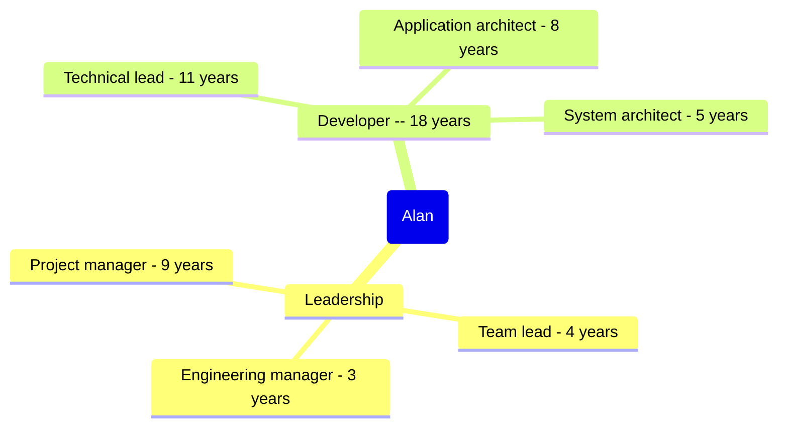

title: Prior Roles and Achievements
subtitle: Alan Ray Profile
status: hidden
slug: profile-roles-n-achievements
layout: page

[TOC]

One of the best parts of small, fast-moving companies is the chance to do what what is required, regardless of one's official title[^title]. Over the years, I've worn many hats, sometimes formally and often informally:

[^title]: One of the downsides of working for small startup companies is the necessity of doing what is required, regardless of one's official title. Another downside is that roles and titles don't keep up with reality.

# Spotlight Project: Billing System Overhaul

_Hats: Lead architect, project manager, team lead, developer_

# Projects

## Ansible
## Monolith to Microservices
## Architectural Practices
  (challenge: APIs)
## Atlas (one)
## MacOS App
## Frogger
## Navigation
## Police algorithm

# Sustainables

Sometimes the important work isn't a project per se, but what happens that makes the project work possible.

## APIs
## Mentorship
## Hiring
## Team Growth
## CI/CD System (BuildKite)

# Technical Roles

__Systems architect (5 years)__

My first noteworthy system design was the introduction of Ansible to hundreds of VMs, moving from a small prototype to a standard staple for a few developers to a department standard LINK. Eventually for a department of about 25 developers, I was planning long-term architectural direction based on business objectives while making short-term decisions that balanced ongoing engineering plans and immediate product asks while also aligning with individual developer capabilities and interests. My most significant work included replacing a legacy billing system with a modern compartmentalized one LINK, transitioning a legacy monolith to microservices LINK, and improving architecture practices across the department LINK.

__Application architect (8 years)__

The first two major applications I designed were a hazmat navigation system for commercial trucks LINK and a radio communication protocol for police cars LINK. And yes, I was terrified that someone would die because a police officer's radio wouldn't work in a critical situation. After that, I moved into building a web application that safely modified critical algorithms LINK, re-architecting a legacy MacOS application for sustainable development LINK, and designing (and building) an in-house CI/CD system from scratch LINK. One of my most recent projects has been a distributed application that measures the daily developer experience. LINK.

__Technical lead (11 years)__

Once I joined a company with a team-based approach, the role of technical lead was a natural fit. My leadership and mentoring LINK led to successful projects such as LINK and LINK and LINK. Part of what made me a great technical lead was that I saw from the big picture and the business objectives all the way to the technical implications of using an enum rather than constants. I organized the project work, communicated well with developers and managers, and broke big messy blocks of work into appropriately sized chunks when other developers struggled. I also started my journey on technical interviewing LINK, eventually running technical evaluation for a software team of 25.

__Developer (18 years)__

My professional developer career started at a small firm with a sink-or-swim environment: no hand holding[^mentor], everyone needed to carry their weight, mostly independent development. I was often the only person checking my code before it shipped. While I was a good coder going into the position, this work taught me the ins-and-outs of development such as error handling, debugging my own code, debugging live systems, validating requirements, and interfacing with undocumented[^under] components.

[^mentor]: I did have several very thoughtful and experienced mentors, though, who taught me much of what I know.

[^under]: Or under-documented. In one case, we got a specification for a complex state machine in Japanese. There are also misdocumented components, which are always fun to resolve.

# Leadership roles

__Project manager (9 years)__

I got my start in project management (LINK) on a highly technical project because of my ability to evaluate, plan, and break down work -- along with the ability to appropriately pivot when the unexpected happens. Since then, I've frequently managed projects, especially highly technical ones. A few examples are LINK LINK LINK.

__Team lead (4 years)__

The billing project LINK was my first chance to run a team (as well as building it from scratch). From ceremonies to project cadence to supporting team members' goals, I led the team through from project inception to delivery and then transitioned it into a DevX team. This was a chance to test a lot of my theories of leadership, and I'm really pleased with how they worked out (LINK TO SAID). Through delegation, mentoring, and focusing on principles and goals, I passed on my strengths in independently prioritizing and executing. When I was unexpectedly away, the rumor was that my team was the most capable of all the teams at running itself, regardless of managerial oversight.

__People manager (3 years)__

Eventually I picked up the HR supervising responsibility for my team as well. Since I had a great team and already had practices such as supporting reports' goals and providing quality feedback, I found this transition was mostly a day-to-day formality. But I learned about behind-the-scenes processes such as corporate budgeting and hiring requisitions.
