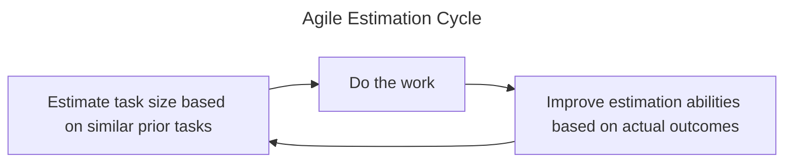

title: Card Estimation: Pointless Process?
subtitle: Performative agile
date: 2024-07-01
category: software design
tags: user experience, process, incentives
status: published

> _Proposed: At least 74% of agile estimation is a waste of time and energy._

[Agile](https://agilemanifesto.org/) is supposed to be a new set of values, valuing individuals and interactions over processes and tools -- among other things.

Yet when it comes to estimation, there seems to be a fascination with the process, regardless of the results. On paper, the Agile estimation process seems quite reasonable:

The idea is that the team will be doing similar tasks for a long enough period that it's possible to chart the team's velocity and make reasonable approximations about when a project will finish.

There's even a clever observation that humans are much better an comparison (an elephant is bigger than tiger; a tiger is about the same size as lion) than they are at precise estimates. So rather than estimating in time, Agile estimates in story points or T-Shirt sizes or something similar. There's even the helpful observation that we don't need fine grained resolution -- does it really matter if a card is 10 or 11 points? -- and so many approaches use a variant of the Fibonacci sequence to reduce cognitive load.

What could go wrong?

# The problems

The first set of problems revolve around the assumptions being made:

_The team will be doing similar tasks for a long enough period._

Many teams I know are often doing rather different tasks each sprint. The first time implementing redis. The first time implementing the new date/time picker. The first time implementing redis now that the new authentication protocols are in place. The second time implementing the new date/time picker, but Jane who did it last time is out on vacation and the design calls for a new Serif font that's never been used.

In short, there aren't enough similarities between tasks to build up a familiar set of reference tickets. It's like playing pictionary with a new group of people each time -- there's no convention or group think to take advantage of.

_The overhead of creating most of the necessary tickets._

In order to get the benefit of estimating when a project will end, one needs most of the work to exist as a ticket -- and the tickets need to be small enough to be estimated. This is a significant amount of work, almost waterfall like. All too often, new product requirements, implementation realities, or new organizational objectives end up shifting the necessary work. The result is either another massive effort to define all the work, or an obsolete project estimate. This problem gets worse the further ahead one is trying to estimate, as the more work that needs to be carefully defined.

_The team will spend the time to properly estimate._

Team estimation is a time consuming task. Some of this is healthy, because it reveals differing assumptions about the work. But especially on a team with lots of unfamiliar tasks, hours can be spent coming to a consensus on estimates.

Teams aren't stupid; that's an incredible amount of time that most people don't enjoy...and so the process starts getting short-circuited. Individuals are asked to start estimating cards. That creates the estimates, but means there's even less of a team-wide sense of what any particular number means.

_Companies often have competing rhythms._

While agile promotes the idea of doing the most important work now, many companies have non-Agile rhythyms that guide larger planning. Annual budgets. Quarterly OKRs. Six week [Shape Up projects](https://www.productplan.com/glossary/shape-up-method/). Often the scope of the project is largely driven by the available time and available personnel. Thus the question becomes "What can these 2 people get done before the feature launch in ten weeks?" far more than it is about accurately estimating the work that product wants to achieve.

_Teams will spend the time to calibrate (improve) their estimation based actual results._

The idea is that while a team may not be very good at estimating at first, by looking at how close their estimations were to reality (was this ticket really about the same size as this other one), teams can rapidly improve the accuracy of their estimation.

This might be true; I've never heard of a team that actually had the discipline to calibrate their estimations.

_Teams actually understands the majority of the work._

Preplanned tickets can be pretty good about what it takes to initially ship the feature. They're often very bad, though, at determining what needs to happen for the feature to be a success:

* Users aren't discovering the feature because it isn't list on the user page, which is owned by another squad.
* Users are generating several times more data than expected and the database strategy can't handle the reads and writes.
* Meanwhile, the third-party geolocation service often has high latency under load, so either a rework or a new provider is a necessity for continued growth.
* User experience discovers a large uptick in complaints because the feature's biggest fans are Enterprise customers, not the small companies the workflow was designed for.
* This unexpected customer reaction has product is rethinking their approach.

_The team capabilities are more or less interchangable._

In my career, I've discovered that tasks are rarely interchangable. There's the one person who knows the legacy backend really well. The other developer who understand the intricacies of TypeScript. The one person who just rewrote the DateTime picker to be more usable, but nobody else understand the new pattern. And so on. As a result, there's really two velocities: The velocity when everyone is in their comfort zone, and the velocity that would occur if cards were being grabbed more or less at random.

_The team will be more or less stable_.

Many companies are moving at fast paces. People join the team, people leave the team. At times, reorganization, leadership changes, and changing responsibilities are more the norm than the exception. Each organizational change causes the estimation process to get more uncertain.

_Recap_

So far, I've looked at the process flaws that undermine most of the Agile estimation I'm aware of. Even if people are going through the motions, the way that it is done isn't rigorous enough to achieve the intended result -- semi-reliable estimates for when software well be done.

# The value problem

Worse yet, I can't think of a story when an Agile-derived estimate mattered. When was the last time I saw any leader look at the team's velocity, look at the project story points, and say "Well, that's about 100 points to finish; the team does about 20 points a cycle, so that's about 5 cycles out -- say, 3 or 4 months?"

On my first big project, I ran a very light-weight estimation process (no calibration, of course) and carefully tracked team velocity for about a year. I had a fantastic idea of how many story points happened each week. And it was completely irrelevant:

* I never used the data to estimate.
* No leader ever asked about my estimation methodology.
* Timelines changed based on changing requirements.

Overall, because the project did a good job avoiding late-stage blow-ups and validated big unknowns upfront, timeline changes were relatively small and accepted as the uncertainties of software development. And in no scenario would more attention to estimation have done any good. If I were doing that project over again, I would have completely scrapped even the light-weight estimation that I did.

# The process problem

In a world that valued individuals and interactions over processes, one might expect that time-consuming and error-prone process would be quickly slashed. Particularly if it wasn't generating useful outcomes for anybody. After all, a valueless time sink is terrible ROI. If nothing else, give employees a bit of extra PTO each week and earn some good will. The ROI is still terrible, but at least it is positive.

However, my observation has been estimation has a habit of being sticky. People may not actually do it, particularly not the way that Agile suggests, but they are loathe to abandon it.

I have a few ideas for why:

* Doing the standard thing rarely creates waves. All[^all] the books say estimation is the way to go.
* It gives the illusion of impact. One can report "Yes, we've got 20 points of work scheduled for this sprint." and it feels like something meaningful is being said.
* People have the intuition that some sort of estimation is important, and Agile estimation is the standard procedure.

[^all]: Well, at least many. I've seen some pushback in various places.

But most importantly, many forms of Agile estimation are formulaic and thoughtless; something that can regularly happen in a rote fashion without much thought or consideration. And since the outcome doesn't really matter and people have the intuition that estimation matters, the estimation is seen as a productive signal.

In short, it comes performative to "signal" that important work is happening, without consideration for whether the process is actually worthwhile.

# So what

Is my assessment of Agile estimation too harsh? On paper, the theory seems sound enough. I'm sure there are companies that are effectively leveraging it. But I'm gradually coming to the conclusion that much of the Agile estimation I've encountered is actually anti-Agile.

What do you think? Is Agile estimation typically more useful than I suggest? When have you seen it be an effective use of the team's time?
