title: Measurement and Feedback Loops
date: 2022-06-27
category: practices and principles
tags: agile, devops, strategy
status: published

[TOC]

Tim Cochran has a great writeup on [developers and feedback loops](https://martinfowler.com/articles/developer-effectiveness.html) along with broader reflections on agile-oriented development.

Implicit with the idea of feedback loops is the idea of measurement. Afterall, if one cannot measure how fast the feedback loop is, how is one going to decide if it needs improvement?

# Measure Twice, Cut Once

Measurement is challenging, especially when it comes to people and coding problems. With lumber, cutting a board to length is pretty much the same process every time, which makes it relatively easy to measure how long it takes to cut the board.

> __Goodhart's Law__: When a measure becomes a target, it ceases to be a good measure.

With software, questions emerge:

- _Is this scenario typical or a one-off?_ Almost by definition, one-off scenarios will take abnormally long and are often under the gun, so they tend to grab management attention. But if one only measures abnormal situations, the measurement won't reflect typical behaviors.
- _Is it worth the overhead to measure every occurrence of a feedback loop?_ One way to avoid fixating on the abnormal is to always measure a feedback loop.
- _What am I actually measuring?_ For example, if I want to know how long it takes to find the root cause for a defect, I might measure when the developer starts work on finding the defect and when she finds the cause. But if the developer had many meetings, I might more be measuring how many meetings the developer has far more than the quality of software. Likewise, what if the developer is identifies the wrong cause? I may be measuring how long it takes the developer to think they've found the root cause, not the actual time to find the root cause.
- _What do I need to measure?_ Maybe it is good enough to know what the worst case feedback loop is - when the developers have lots of meetings and the problem is really thorny. If the worst case tends to be 3-4 days, then maybe that's enough to say my team has an effective ability to find root causes.
- _How will the measurement impact the team dynamics?_ Goodhart's Law captures the danger of making targets out of measurement. Set a target number of lines of code written per developer, and the code becomes insanely verbose. Measure the number of commits, and developers fragment their work. So it's important to integrate measurement in a way that creates the desired team dynamics.

# Deliver Value, Not Metrics

At the end of the day, what matters is delivering value to customers (broadly defined[^customers]). That is, it doesn't matter whether the system reports no errors if customers can't buy from the online store. And the shiny new build system that tells me in 5s that everything is broken isn't much use if it can't be fixed.

[^customers]: I'm using customers broadly here - the executives might be the customer for product performance metrics. The accounting team might be the customers for financial audits. The developers might be the customers for a more delightful development environment.

In deciding what value to deliver, there are feedback loops just like in software. Here are three basic ones:

* How long does it take the decision makers[^makers] to know about the problem or pain?
* How long does it take the decision makers to know how much the change is worth?
* How long does it take the decision makers to know what the change will cost (including opportunity costs)?

Consider these two decision making paths:

```mermaid
flowchart TD
  subgraph Option Two
    a(Developer spots typo)
    b(Developer commits change)
    c(Change automatically deploys with next release)
    a --> b --> c
  end

  subgraph Option One
    d(Developer spots typo)
    e(Developer asks manager if fixing it is a priority)
    f(Manager asks brand standards if it really is a typo)
    g(Manager tells developer to fix it after the current work)
    h(Developer makes a note to himself)
    i(Developer forgets for a while)
    j(Developer commits change)
    h(Change automatically deploys with next release)
    d --> e --> f --> g --> h --> i --> j
  end
```

The option one change is far more expensive: More people are more disrupted and the value takes far longer to roll out. However, the second option isn't quite as straightforward as it might seem.

1. The developer needs to be able to recognize typos (within reasonable accuracy).
2. The developer needs to recognize when a change is complicated enough to require outside expertise (e.g. it's more than just a typo)
3. The company needs to be willing to accept some misjudgments by the developer in exchange for faster fixes. If someone in brand standards is being evaluated based on "number of typos released," he might prefer the option one approach because it makes his metrics look better (yes, Goodwin's law again).

One last note here: I intentionally use the plural _decision makers_, but the more people are in the mix, the more communication overhead there is. One way to effectively speed up these feedback loops is to reduce the number of people involved as much as possible. Of course, fewer people has other consequences.[^consequences].

[^consequences]: Fewer people usually means fewer experts and fewer eyes to catch problems. For a typo, that's likely not a big deal. But when it comes to the big new multi-million product initiative, that's a lot bigger deal.

# Approximating Value

As a rule of thumb, I prefer approaches that:

* Trust and empower teams (and the individuals within) to make good choices.
* Minimize process overhead.
* Provide appropriate feedback to decision makers

One of the aspects of scrum that I've struggled with is the concepts of estimation and velocity. One reason for this is that velocity is not a measure of value delivered - that is, yes, 4 user stories worth 53 story points were delivered in the last month. But those 53 story points are an estimate of development effort, not an estimate of business value.

_So how might a company solve this problem in a way that minimizes overhead and aligns the development team's work with the business objectives?_

For some projects, it's worth doing a detailed return-on-invest calculation. But often, that's overkill or requires data that isn't available and can't be quickly collected[^anything]. How else might the problem be solved?

In European-style [boardgaming](https://boardgamegeek.com/), there's an argument that everything can be reduced to an auction. Imagine doing something similar and creating a value-driven reward system for development teams.

* Each decision maker gets a budget of N points per month.
* Each decision maker offers the team M points for achieving some outcome. This can be a single outcome worth N points, five outcomes worth N/5 points, or any other desired distribution.
* The team's goal is to maximize the number of points they earn over time.

## Auction-Based Value

How might this system work?

* The marketing director wants a new piece of data tracked, so he offers some points to add new behavior.
* The CIO wants various security metrics achieved, so she offers points for hitting those metrics.
* The customer service department wants a better way to report bugs, so they offer some points if bug reporting can be reduced to under 60 seconds, and far more points if it can be reduced to under 30 seconds.

Then the team can look at their incentives and pick the work they think will achieve the most value. At the end of the month, the team reports on how many points they earned.

# Strengths and Complications

This system has a number of strengths. Consider these benefits:

* Measurable deliverables are tied to value.
* Teams have wide discretion in what to work on and how to achieve it.
* High flexibility in what outcomes are valued. If new skills are valued, points can be awarded for training; if uptime is valued, points can be awarded for uptime, and so on.
* ROI calculations are approximated without requiring complex coordination between decision makers and the team.
* Maintaining functionality over time becomes part of what earns teams points. Thus the maintenance overhead is visible to the decision makers -- and if a feature isn't worth maintaining, it likely will be removed as the team decides it isn't worth the effort.
* Teams are incentivized to improve how they work in order to maximize their points.
* The incentive structure is clear to the decision makers and the team. If decision makers don't like what is being shipped, it's easy to explain why the team is making such choices.

However, there are some complications with such a system:

* Some outcomes may be fundamentally non-negotiable. A data breach may not be acceptable no matter what else is delivered. While there are ways of modeling this in the auction (e.g. the team gets 0 points if there is a data breach), such approaches may not adequately indicate the business consequences of such an outcome.
* Some outcomes may require a longer time horizon than a month. A move to cloud computing or a state-of-the-art CI/CD system may not be beneficial in 6 months or 12 months, but may be a 3 or 5 year strategic bet.[^short]
* Destructive conflict can arise about whether or not an outcome was achieved if the decision makers and the team lack trust or a common understanding of work standards.

[^short]: In general, an agile philosophy often struggles to make long-term bets or improvements; switching the architecture over to AWS only to discover it is 2x more expensive is a really expensive mistake if it takes months to execute and longer to correct, but it may be hard to see the whole picture before the change is executed.

# Final Thought

The idea of identifying feedback loops and optimizing the key ones makes a lot of sense, not just in the actual development of software, but the entire decision making process around software. Yes, there will be approximations and complications, but the smoother the process, the more developers can focus on delivering valuable software, which is good for the business.

[^anything]: Obligatory mention of _[How To Measure Anything](https://www.amazon.com/How-Measure-Anything-Intangibles-Business/dp/1118539273)_; it's well worth reading for creative ideas on how to approximate many unknowns.
