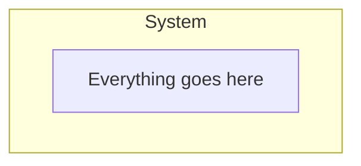
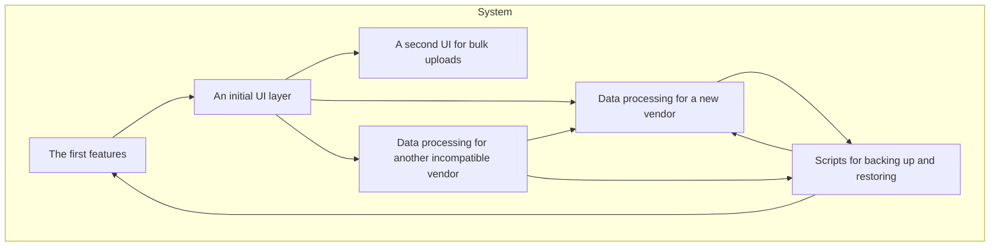
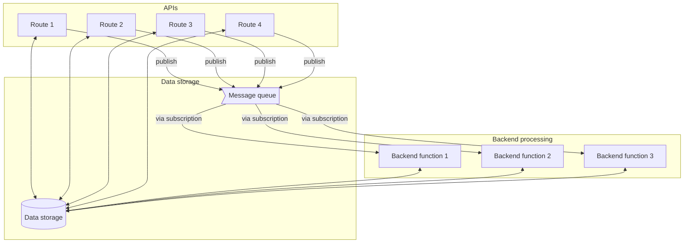

title: Sustainable Complexity
subtitle: Juggling tradeoffs
date: 2023-10-16
category: practices and principles
tags: uncertainty, architecture
status: published

> Just use 0.0.0.0.
>
> _Hypothetical pragmatic engineer, on the fastest solution._

Suppose you and a friend are doing a small startup, coding away on a prototype. It's late at night at the local coffeeshop. Your co-founder -- Janet -- wants to see your prototype feature page so she can grab some screenshots for some fundraising efforts. What's the fastest way to share so you can get back to coding?

_Why, host the website on 0.0.0.0 and point Janet at your public ip address, of course._

(My apologies for the heart attack I probably just gave to any security minded folks[^security].)

[^security]: For those who don't know, the 0.0.0.0 mask makes the site accessible to anyone who can reach the computer. A small startup operating out of a coffeeshop likely doesn't have a VPN or other airgap, making the website -- and any associated vulnerabilities -- accessible to anyone on the coffeeshop's network -- or anyone who has compromised the network.

And that's how quickly one moves into the complexity of juggling speed vs. sustainability. It might be reasonable to argue that any particular custom website publicly open for a few minutes at any particular coffeeshop isn't a particularly high risk. Then again, what's the plan if a ransomware attack finds an opening and encrypts the disk? How much does the startup have backed up?

The problem, of course, is that this decision likely isn't just for a few minutes now. It's likely to become a habit. `0.0.0.0` gets added to a configuration script somewhere and forgotten about. The startup is successful, adds in a few more employees. The startup gets a VPN. Everybody's busy, nobody thinks about why it is so easy to see one another's work. And then one day, someone makes some other misconfiguration. Or perhaps a vulnerability in the underlying web application framework is discovered. Maybe the surface area of the attack hasn't quite reached critical mass. Maybe it will take one more step -- maybe someone puts a version of the prototype on the web for an important customer to try out -- before all individual vulnerabilities tie together to create a exploitable hole. But the risk is accumulating.

# Tradeoffs

Security isn't the only non-functional requirement that has this trade-off. Here are a few more:

- _Maintainability_: As long as there's no employee turnover, the team can move faster by not writing down institutional knowledge. And much of the documentation becomes outdated almost as soon as the commit is merged.

- _Testability_: How much of the code needs to be tested? How much do the expectations of third-party libraries need to be tested? On an Agile, fast-moving team, how much of that code will actually last long enough for tests to matter? Will the right things even be tested?

- _Permanence_: How long is the solution intended to last anyway? Maybe the whole goal is to prove to investors that this idea has legs. In that case, vendor lock-in really doesn't matter. But if the idea really does have legs, will the company have the discipline to go back and create a longer-term solution? When the company is worth millions, will anyone even remember those vendor-specific dependencies or the risk they pose to the company?[^graveyard]

[^graveyard]: The [Google Graveyard](https://killedbygoogle.com/) is infamous, but I'm surprised how many other popular libraries and tools don't make it. They get supplanted, abandoned, or acquired. Perhaps someone decides the current open source model isn't profitable. Or maybe someone just decides to take their marbles and go home.

# Architecture

Even architecture itself is one of these non-functional requirements with trade-offs. Consider how the classic spaghetti monolith comes to be. At first, it's easy to build:

But over time, that approach starts getting more and more complex until we're well on our way to classic [spaghetti code](https://en.wikipedia.org/wiki/Spaghetti_code) where everything is highly interconnected and it's hard to modify or add pieces without understanding all the other pieces.

And now every time anyone changes anything, there are side-effects. The whole system might come down just because some developer updated the way the system interacts with the proprietary system and that has an unexpected side effect on another data system, which cascades into a rendering layer that wasn't properly isolated.

Hrm, that's not looking so promising. What if we start off with a different architecture? Maybe using light-weight lambdas? Maybe we get a first pass of a system like this:

So this looks pretty manageable at first. Maybe a bit more complex, but not bad. At least there are clearly defined interface layers.

But how is this approach going to scale? If this is the first feature, what's it going to look like after a second feature? A third? A tenth? Even this pretty simple mockup with a few APIs, a few backend behaviors, a database, and a message queue for coordinating is starting to look like [serverless spaghetti](https://medium.com/codex/managing-serverless-spaghetti-c2fb1a7db73e). Sure, each piece can be modified, built, tested, and deployed individually. But because it is their orchestrated unified behavior that matters, a change to any part can disrupt the whole. Moving the interconnection from within a giant monolith to being distributed across a serverless architecture hasn't actually solved the problem; it's just transformed where the complexity lies.

# So what

I don't believe there are any easy answers. There's no upfront architecture that matches every step in a application's life journey, from prototype to first release to massive hit to sunset. Nor is ChatGPT going to introduce a "refactor architecture" button anytime soon.

But I do believe there are a few guiding principles. Here are two:

## Budgeting for changing non-functional requirements

Business leadership needs to understand and budget for changing non-functional requirements. Architectural choices should be tightly calibrated against the business objectives. If the company wants a prototype for internal purposes, it may not need any formal architecture. But when it becomes a paid service that needs 24-7 reliability, that prototype architecture won't work any more.

Business leadership also need to understand that, by and large, the cost is an unknown. When the decision is made to build for aesthetics and not worry about load time, the non-functional requirement becomes "load time doesn't really matter as long as nobody complains." After a year of developing, what will it take to achieve highly responsive load times of sub-200 milliseconds? Is it just a matter of optimizing a few routes? Or perhaps adding a cache? Or will the whole data pipeline need to be redesigned? Perhaps the choice of a single-page application is too slow for this problem, and a new approach is needed?

This understanding isn't easy; business leadership often focuses on tangibles like features, monthly active users, and revenue. But it's essential for them to understand that every non-functional requirement adds complexity, and changing the non-functional requirements typically adds a cost that must be paid.[^debt]

[^debt]: Sometimes this cost is paid in technical debt, which typically manifests with slower teams over time making more mistakes.

## Architect for no red tape

One of the great strengths of well-functioning Agile is that it gives teams the power to execute. Handoffs between humans are inherently slow, and eliminating them is one of the best ways to make everything move faster.

The problem is that modern software engineering has a lot of domain-specific knowledge. How many software engineers are top-notch security engineers? Kubernetes specialists? With Helm and Terraform knowledge? What about the CI/CD system? Internationalization? And fluent in diagnostics through OpenTelemetry and the ELK stack?

And this specialization means some sort of coordination is required. I'm a huge fan of [Team Topologies](https://teamtopologies.com/key-concepts) which reverse engineers [Conway's Law](https://en.wikipedia.org/wiki/Conway%27s_law). That is, instead of how a company works being decided by its org chart, the org chart is decided by how the company should work.

And this is where architecture comes in. What specializations need to exist within the company? And how will they interact with each team in a way that lets the team quickly deliver changes while still making use of their specialized knowledge?

One particular idea comes to mind here: I'm a huge fan of "bottleneck" points in architecture that are hard to change, but provide certain guarantees. For example, [teach nginx to use JWT authentication](https://docs.nginx.com/nginx-management-suite/nim/previous-versions/v1/getting-started/auth/#jwt-auth) and then require nginx as an intermediary before each application. Now there's a guarantee for each application that all calls have validated JWT tokens. This isn't the only guarantee needed to operate securely[^only], but a few such bottlenecks can go a long way to simplify the day-to-day cognitive load of development while also providing a robust non-functional requirement -- in this case, around security authentication.

[^only]: Solving authentication, for example, doesn't guarantee authorization to see particular data or take a particular action.

How else can engineers juggle the complexities of non-functional requirements in a sustainable manner?
